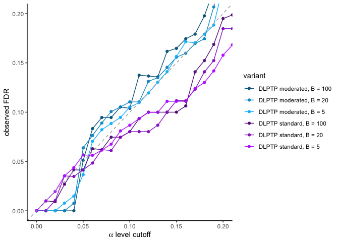

Benchmark on synthetic dataset
================
07 July, 2020

# Step-by-step walk through the `TPP2D` analysis

``` r
# This script uses the development version of TPP2D
if(require("BiocManager"))
  install.packages("BiocManager")
BiocManager::install("nkurzaw/TPP2D")
```

Load required libraries

``` r
library(TPP2D)
```

    ## Loading required package: dplyr

    ## 
    ## Attaching package: 'dplyr'

    ## The following objects are masked from 'package:stats':
    ## 
    ##     filter, lag

    ## The following objects are masked from 'package:base':
    ## 
    ##     intersect, setdiff, setequal, union

``` r
library(dplyr)
library(tidyr)
library(ggplot2)
library(readxl)
library(AnnotationDbi)
```

    ## Loading required package: stats4

    ## Loading required package: BiocGenerics

    ## Loading required package: parallel

    ## 
    ## Attaching package: 'BiocGenerics'

    ## The following objects are masked from 'package:parallel':
    ## 
    ##     clusterApply, clusterApplyLB, clusterCall, clusterEvalQ,
    ##     clusterExport, clusterMap, parApply, parCapply, parLapply,
    ##     parLapplyLB, parRapply, parSapply, parSapplyLB

    ## The following objects are masked from 'package:dplyr':
    ## 
    ##     combine, intersect, setdiff, union

    ## The following objects are masked from 'package:stats':
    ## 
    ##     IQR, mad, sd, var, xtabs

    ## The following objects are masked from 'package:base':
    ## 
    ##     anyDuplicated, append, as.data.frame, basename, cbind, colnames,
    ##     dirname, do.call, duplicated, eval, evalq, Filter, Find, get, grep,
    ##     grepl, intersect, is.unsorted, lapply, Map, mapply, match, mget,
    ##     order, paste, pmax, pmax.int, pmin, pmin.int, Position, rank,
    ##     rbind, Reduce, rownames, sapply, setdiff, sort, table, tapply,
    ##     union, unique, unsplit, which, which.max, which.min

    ## Loading required package: Biobase

    ## Welcome to Bioconductor
    ## 
    ##     Vignettes contain introductory material; view with
    ##     'browseVignettes()'. To cite Bioconductor, see
    ##     'citation("Biobase")', and for packages 'citation("pkgname")'.

    ## Loading required package: IRanges

    ## Loading required package: S4Vectors

    ## 
    ## Attaching package: 'S4Vectors'

    ## The following object is masked from 'package:tidyr':
    ## 
    ##     expand

    ## The following objects are masked from 'package:dplyr':
    ## 
    ##     first, rename

    ## The following object is masked from 'package:base':
    ## 
    ##     expand.grid

    ## 
    ## Attaching package: 'IRanges'

    ## The following objects are masked from 'package:dplyr':
    ## 
    ##     collapse, desc, slice

    ## 
    ## Attaching package: 'AnnotationDbi'

    ## The following object is masked from 'package:dplyr':
    ## 
    ##     select

``` r
library(org.Hs.eg.db)
```

    ## 

``` r
library(TPP)
```

    ## Loading required package: magrittr

    ## 
    ## Attaching package: 'magrittr'

    ## The following object is masked from 'package:tidyr':
    ## 
    ##     extract

Download and read in required datasets for true positive spike-in
profiles: - Panobinostat cell dataset Becher et al. (2016) - JQ1 lysate
dataset Savitski et al. (2018) - Ampicillin *E. coli* lysate
(<span class="citeproc-not-found" data-reference-id="Mateus2018">**???**</span>)
- ATP crude lysate rep1
(<span class="citeproc-not-found" data-reference-id="Sridharan2019">**???**</span>)

``` r
# Pano datasets
if(!file.exists("../Panobinostat_HepG2_cell_2DTPP_Becher_et_al_2016/41589_2016_BFnchembio2185_MOESM254_ESM.xlsx")){
download.file(
  url = "https://static-content.springer.com/esm/art%3A10.1038%2Fnchembio.2185/MediaObjects/41589_2016_BFnchembio2185_MOESM254_ESM.xlsx",
  destfile = "../Panobinostat_HepG2_cell_2DTPP_Becher_et_al_2016/41589_2016_BFnchembio2185_MOESM254_ESM.xlsx") 
}

# JQ1 dataset
if(!file.exists("../JQ1_THP1_lysate_2DTPP_Savitski_et_al_2018/Savitski_et_al_Figure_3/Supplementary Dataset 2_2D-TPP.xlsx")){
    download.file(
      url = "https://data.mendeley.com/datasets/8pzhg2tdyb/1/files/115f60c9-01d1-4213-9abb-aa095d70a626/Savitski%20et%20al%20Figure%203.zip?dl=1",
      destfile = "../JQ1_THP1_lysate_2DTPP_Savitski_et_al_2018Savitski_et_al_Figure_3.zip") 
    unzip(zipfile = "../JQ1_THP1_lysate_2DTPP_Savitski_et_al_2018/Savitski_et_al_Figure_3.zip", 
        exdir = "../JQ1_THP1_lysate_2DTPP_Savitski_et_al_2018/Savitski_et_al_Figure_3")
    system("rm ../JQ1_THP1_lysate_2DTPP_Savitski_et_al_2018/Savitski_et_al_Figure_3.zip")
}
```

``` r
jq1_lys_raw <- read_xlsx("../JQ1_THP1_lysate_2DTPP_Savitski_et_al_2018/Savitski_et_al_Figure_3/Supplementary Dataset 2_2D-TPP.xlsx", sheet = 3, skip = 1) %>% 
  dplyr::select(representative = `Accession No.`,
                clustername = `protein name`,
                qupm = QUPM,
                qusm = QUSM,
                temperature,
                matches("sumionarea"),
                -matches("total"),
                matches("rel_fc_protein"),
                -matches("transformed"),
                -matches("orig"))  %>% 
  gather(key, value, matches("sumionarea"), matches("rel_fc_protein")) %>% 
  mutate(conc = as.numeric(gsub("uM", "", gsub(".+_protein_[0-9,H,L]+_[0-9,H,L]+_", "", key))),
         temperature = as.numeric(gsub("C", "", temperature)),
         key = case_when(grepl("sumionarea", key) ~ "raw_value",
                         grepl("rel_fc", key) ~ "rel_value")) %>% 
  spread(key, value) %>% 
  arrange(representative, temperature, conc) %>% 
  group_by(clustername, temperature, conc) %>% 
  filter(qupm == max(qupm), 
         qusm == max(qusm), 
         raw_value == max(raw_value)) %>% 
  filter(!duplicated(clustername)) %>% 
  ungroup %>% 
  mutate(log2_value = log2(raw_value),
         log_conc = log10(conc/1e6)) %>% 
  filter(qupm > 1)

# resolve ambiguous protein names
jq1_lys_fil <- resolveAmbiguousProteinNames(jq1_lys_raw)
  
# recompute reporter ion signal from robust Isobarquant fold changes
jq1_lys_df <- recomputeSignalFromRatios(jq1_lys_fil)
```

``` r
pano_raw <- read_xlsx("../Panobinostat_HepG2_cell_2DTPP_Becher_et_al_2016/41589_2016_BFnchembio2185_MOESM254_ESM.xlsx", 
                           sheet = 1, skip = 1) %>% 
  dplyr::select(representative,
                clustername,
                experiment = ms_experiment,
                qupm,
                qusm,
                temperature,
                matches("sumionarea"),
                -matches("total"),
                matches("rel_fc_protein"),
                -matches("transformed"),
                -matches("orig"),
                -matches("log2rel"))  %>% 
  gather(key, value, matches("sumionarea"), matches("rel_fc_protein")) %>% 
  mutate(conc = as.numeric(gsub("uM", "", gsub(".+_protein_[0-9,H,L]+_[0-9,H,L]+_", "", key))),
         temperature = as.numeric(gsub("C", "", temperature)),
         key = case_when(grepl("sumionarea", key) ~ "raw_value",
                         grepl("rel_fc", key) ~ "rel_value")) %>% 
  spread(key, value) %>% 
  arrange(representative, temperature, conc) %>% 
  group_by(clustername, temperature, conc) %>% 
  filter(qupm == max(qupm), 
         qusm == max(qusm), 
         raw_value == max(raw_value)) %>% 
  filter(!duplicated(clustername)) %>% 
  ungroup %>% 
  mutate(log2_value = log2(raw_value),
         log_conc = log10(conc/1e6)) %>% 
  filter(qupm > 1)

# resolve ambiguous protein names
pano_fil <- resolveAmbiguousProteinNames(pano_raw)
  
# recompute reporter ion signal from robust Isobarquant fold changes
pano_df <- recomputeSignalFromRatios(pano_fil)
```

``` r
atp_df <- readRDS("../pre_run_data/atp_df.rds")
amp_df <- readRDS("../pre_run_data/amp_df.rds")
```

``` r
atp_fil <- TPP2D:::.independentFilter(atp_df, fcThres = 1.25)
```

``` r
all_atp_binder <- AnnotationDbi::select(
  org.Hs.eg.db, 
  keys = "GO:0005524", 
  columns = c("SYMBOL", "IPI"), 
  keytype = "GOALL")
```

    ## 'select()' returned 1:many mapping between keys and columns

# Identify noise induced variation from JQ1 dataset

## JQ1 lysate

``` r
sd_log2_val_jq1 <- jq1_lys_df %>% 
  group_by(representative, temperature) %>% 
  summarise(sd_log2_value = sd(log2_value)) %>% 
  ungroup() %>% 
  filter(!is.na(sd_log2_value)) %>% 
  group_by(temperature) %>% 
  mutate(quant_95 = quantile(sd_log2_value, 0.95)) %>% 
  filter(sd_log2_value < quant_95) %>% 
  ungroup()
```

    ## `summarise()` regrouping output by 'representative' (override with `.groups` argument)

``` r
ggplot(sd_log2_val_jq1, aes(sd_log2_value)) +
  geom_density()+
  facet_wrap(~temperature)
```


# Simulate data

``` r
set.seed(12)
nobs <- c(20, 30, 40, 50, 60)

log_concs <- c(-Inf, -7, -6, -5.3, -4.7)

temperatures <- c(42.1, 44.1, 46.2, 48.1, 
                  50.4, 51.9, 54.0, 56.1,
                  58.2, 60.1, 62.4, 63.9)

alphas <- seq(0, 1, 0.01)

beta_max <- seq(2, 6, by = 0.01)

ec_50s <- seq(-7, -5, by = 0.01)

slopes <- c(rnorm(500, mean = -1, sd = 0.5),
  rnorm(500, mean = 1, sd = 0.5))


prots <- paste("protein", 1:5000, sep = "")

log2_value_baselines <- seq(21, 27, by = 0.1)

sim_df <- bind_rows(lapply(prots, function(pr){
  # draw number of observations and define temperatures 
  nobs_p <- sample(nobs, 1)
  temp_p <- temperatures[seq_len(nobs_p/5)]
  
  # sample base level for each temperature
  base_p <- sort(sapply(temp_p, function(x) sample(log2_value_baselines, 1)), 
                 decreasing = TRUE)
  # add noise for each concentration
  log2_values <- unlist(lapply(seq_len(length(temp_p)), function(i){
    sd_log2_inten <- 5
    while(sd_log2_inten > max(filter(
      sd_log2_val_jq1, temperature == temp_p[i])$sd_log2_value)){
        log2_inten <- 
          rnorm(5, mean = base_p[i], 
                sd = base::sample(filter(
                  sd_log2_val_jq1, temperature == temp_p[i])$sd_log2_value, 1))
        sd_log2_inten <- sd(log2_inten)
    }
    return(log2_inten)

    }))
  # assemble df
  prot_df <- tibble(clustername = pr,
                    temperature = rep(temp_p, each = 5),
                    log_conc = rep(log_concs, length(temp_p)),
                    log2_value = log2_values,
                    raw_value = 2^log2_values)
})) %>% group_by(clustername, temperature) %>% 
  mutate(rel_value = raw_value / raw_value[which(log_conc == -Inf)]) %>% 
  ungroup() 


ms_exp_df <- tibble(
  ms_experiment = as.character(
    rep(seq_len(length(temperatures)/2), each = 2)),
  temperature = temperatures)   

sim_df <- left_join(sim_df, ms_exp_df) %>% 
  mutate(representative = clustername)

# spike in TPs from different datasets
sim_tp_df <- bind_rows(
  sim_df %>% dplyr::select(representative, clustername, temperature, log_conc, log2_value,rel_value),
  filter(pano_df, clustername %in% 
             c("HDAC2", "HDAC1", "PAH", "FADS1", "TTC38", 
               "FADS2", "TBP", "SCCPDH", "HDAC6")) %>% 
    filter(representative != "IPI00647298.2") %>%  
    dplyr::select(representative, clustername, temperature, log_conc, log2_value, rel_value),
  filter(jq1_df, clustername %in% 
             c("BRD2", "BRD3", "BRD4")) %>% 
    dplyr::select(representative, clustername, temperature, log_conc, log2_value, rel_value),
  filter(amp_df, clustername %in% 
             c("FTSI", "MRCA", "AMPC", "DACB", "MRCB")) %>% 
    dplyr::select(representative, clustername, temperature, log_conc, log2_value, rel_value),
  filter(atp_fil, clustername %in% 
             filter(all_atp_binder, EVIDENCEALL == "IDA")$SYMBOL) %>% 
    dplyr::select(representative, clustername, temperature, log_conc, log2_value, rel_value)
 )

# filter out proteins that will be dropped by the downstream analysis because of too few qupms or too few observations.
sim_tp_df <- sim_tp_df %>%
  filter(!clustername %in% c("IGHMBP2", "LATS1", "MAP4K2", "MTPAP", "RECQL4",
                             "SRPK1", "SRPK2", "AKT1", "DHX9", "INSR"))

saveRDS(sim_tp_df, file = "../pre_run_data/sim_tp_df.rds")
```

``` r
sim_tp_df <- readRDS("../pre_run_data/sim_tp_df.rds")
```

Compute null and alternative model fits and extract parameters

``` r
sim_params_df <- getModelParamsDf(sim_tp_df, maxit = 500)
saveRDS(sim_params_df, file = "../pre_run_data/sim_params_df.rds")
```

Compute *F* statistics

``` r
sim_fstat_df <- computeFStatFromParams(sim_params_df)
```

Do 2 separate rounds of bootstrapping the null distribution:

``` r
set.seed(2, kind = "L'Ecuyer-CMRG")
sim_s2_null_df <- bootstrapNullAlternativeModel(
  df = sim_tp_df, params_df = sim_params_df, 
  maxit = 500, B = 100,
  BPPARAM = BiocParallel::MulticoreParam(workers = 20, progressbar = TRUE),
  verbose = FALSE)
saveRDS(sim_s2_null_df, file = "../pre_run_data/sim_s2_null_df.rds")
```

``` r
set.seed(3, kind = "L'Ecuyer-CMRG")
sim_s3_null_df <- bootstrapNullAlternativeModel(
  df = sim_tp_df, params_df = sim_params_df, 
  maxit = 500, B = 100,
  BPPARAM = BiocParallel::MulticoreParam(workers = 20, progressbar = TRUE),
  verbose = FALSE)
saveRDS(sim_s3_null_df, file = "../pre_run_data/sim_s3_null_df.rds")
```

``` r
sim_s2_null_df <- readRDS("../pre_run_data/sim_s2_null_df.rds")
sim_s3_null_df <- readRDS("../pre_run_data/sim_s3_null_df.rds")
```

Define function to compute the precision and recall based on the
simulated dataset:

``` r
computePrecisionRecall <- function(fdr_df,
                                   alpha_range = seq(0.01, 1, by = 0.01),
                                   ntp = 50){
  out_pr_df <- bind_rows(tibble(precision = 1, recall = 0, alpha = 0),
                         bind_rows(lapply(alpha_range, function(alpha_i){
    hits_df <- TPP2D::findHits(fdr_df, alpha = alpha_i)
    
    r_df <- tibble(
        precision = length(which(!grepl("protein", hits_df$clustername)))/
            nrow(hits_df),
        recall = length(which(!grepl("protein", hits_df$clustername)))/
            ntp,alpha = alpha_i)
  })))
  
  return(out_pr_df)
}
```

Apply threshold-based approach to synthetic dataset

``` r
# set dummy drug concentrations
general_conc_df <- tibble(
  conc_id = 1:5,
  new_conc = paste0("rel_fc_", as.character(c(0, 0.02, 0.143, 1, 5)))
)

# get example data to use temperature and experiment info
data(panobinostat_2DTPP_smallExample, package = "TPP")
config_tab <-  panobinostat_2DTPP_config
config_tab$Experiment <- rep(unique(sim_tp_df$experiment), each = 2)

general_temperature_df <- tibble(
  temp_id = 1:12,
  temperature = config_tab$Temperature
)

# generate data frame as obtained by TPP package
thres_approach_df <- sim_tp_df %>% 
  group_by(clustername, temperature) %>% 
  mutate(conc_id = dense_rank(log_conc)) %>% 
  ungroup %>% 
  left_join(general_conc_df, by = "conc_id") %>% 
  dplyr::select(-log_conc, -log2_value, -conc_id) %>% 
  group_by(clustername) %>% 
  mutate(temp_id = dense_rank(temperature)) %>% 
  dplyr::select(-temperature) %>% 
  left_join(general_temperature_df, by = "temp_id") %>% 
  spread(new_conc, rel_value) %>% 
  rowwise() %>% 
  mutate(unique_ID = paste(c(experiment, temperature, representative), collapse = "_"),
         qupm = 5) %>% 
  ungroup

importSettings <- attr(thres_approach_df, "importSettings")
importSettings$fcStr <- "rel_fc_"
importSettings$proteinIdCol <- "representative"
importSettings$uniqueIdCol <- "unique_ID"
importSettings$nonZeroCols <- "qupm"
importSettings$configTable <- as.data.frame(config_tab)
attr(thres_approach_df, "importSettings") <- importSettings

# normalize fold changes
thres_approach_norm <- tpp2dNormalize(data = thres_approach_df)
```

    ## Found the following column name in attr(data, 'importSettings')$proteinIdCol: 'representative'

    ## Found the following column name in attr(data, 'importSettings')$fcStr: 'rel_fc_'

    ## Performing median normalization per temperature...

    ## Warning: `group_by_()` is deprecated as of dplyr 0.7.0.
    ## Please use `group_by()` instead.
    ## See vignette('programming') for more help
    ## This warning is displayed once every 8 hours.
    ## Call `lifecycle::last_warnings()` to see where this warning was generated.

    ## Warning: Setting row names on a tibble is deprecated.

    ## Done.

``` r
# adapt curve fit function to work with synthetic data
tpp2dCurveFitAdapted <- function (configFile = NULL, data, 
                                  nCores = 1, naStrs = NULL, 
    fcStr = NULL, idVar = NULL, nonZeroCols = NULL, r2Cutoff = 0.8, 
    fcCutoff = 1.5, slopeBounds = c(1, 50), fcTolerance = 0.1) 
{
    if (!missing(configFile)) {
        warning("`configFile` is deprecated.", call. = TRUE)
    }
    if (!missing(naStrs)) {
        warning("`naStrs` is deprecated.", call. = TRUE)
    }
    if (!missing(fcStr)) {
        warning("`fcStr` is deprecated.", call. = TRUE)
    }
    if (!missing(idVar)) {
        warning("`idVar` is deprecated.", call. = TRUE)
    }
    if (!missing(nonZeroCols)) {
        warning("`nonZeroCols` is deprecated.", call. = TRUE)
    }
    TPP:::checkFunctionArgs(match.call(), c("data"))
    importSettings <- attr(data, "importSettings")
    configTable <- importSettings$configTable
    uniqueIdCol <- importSettings$uniqueIdCol
    if (is.null(uniqueIdCol)) {
        stop("attr(data, 'uniqueIdCol') must contain a field named 'uniqueIdCol'.")
    }
    else if (!is.character(uniqueIdCol)) {
        stop("attr(data, 'importSettings')$uniqueIdCol must be of class character.")
    }
    else {
        message("Looking for unique ID column: '", uniqueIdCol, 
            "'")
    }
    if (!uniqueIdCol %in% colnames(data)) {
        stop("Please specify an uniqueIdCol character string argument that represents a suffix of one of \n         the column names of your data!")
    }
    else if (length(data[[uniqueIdCol]]) != length(unique(data[[uniqueIdCol]]))) {
        stop("Please indicate an uniqueIdCol character string that matches a column with unique identifiers!")
    }
    nonZeroCols <- importSettings$nonZeroCols
    if (is.null(nonZeroCols)) {
        stop("attr(data, 'importSettings') must contain a field named 'nonZeroCols'.")
    }
    else if (!is.character(nonZeroCols)) {
        stop("attr(data, 'importSettings')$nonZeroCols must be of class character.")
    }
    else {
        message("Looking for nonZeroCols: '", nonZeroCols, "'")
    }
    if (!all(nonZeroCols %in% colnames(data))) {
        stop("The given QC columns (specified by attr(data, 'importSettings')$nonZeroCols) were not found in the column names of 'data'.")
    }
    finalFcPrefix <- TPP:::obtain_fcStr_from_df_annotation(dat = data)
    message("Performing TPP-CCR dose response curve fitting and generating result table...")
    cfgIn <- TPP:::convert_2D_cfgTable_to_CCR_cfgTable(configTable = configTable)
    datIn <- as.data.frame(data)
    CCRresult <- suppressMessages(analyzeTPPCCR(configTable = cfgIn, 
        data = datIn, nCores = nCores, resultPath = NULL, plotCurves = FALSE, 
        fcStr = finalFcPrefix, naStrs = c("NA", "n/d", "NaN", 
            "<NA>"), qualColName = "qupm", xlsxExport = FALSE, 
        idVar = uniqueIdCol, nonZeroCols = nonZeroCols, normalize = FALSE, 
        r2Cutoff = r2Cutoff, fcCutoff = fcCutoff, slopeBounds = slopeBounds, 
        fcTolerance = fcTolerance, ggplotTheme = NULL, verbose = FALSE))
    compound <- as.character(cfgIn$Experiment)
    allCols <- colnames(CCRresult)
    newCols <- sub(paste("*_", compound, sep = ""), "", allCols)
    colnames(CCRresult) <- newCols
    message("Done.")
    importSettings$r2Cutoff <- r2Cutoff
    importSettings$fcCutoff <- fcCutoff
    importSettings$slopeBounds <- slopeBounds
    importSettings$fcTolerance <- fcTolerance
    importSettings$uniqueIdCol <- "Protein_ID"
    attr(CCRresult, "importSettings") <- importSettings
    attr(CCRresult, "configTable") <- configTable
    return(CCRresult)
}

ccr2dResults <- tpp2dCurveFitAdapted(data = thres_approach_norm)
```

    ## Looking for unique ID column: 'unique_ID'

    ## Looking for nonZeroCols: 'qupm'

    ## Checking which columns in the data table contain the fold change values for fitting and plotting...

    ## Normalized data columns detected with prefix 'norm_rel_fc_'. Analysis will be based on these values.
    ## This information was found in the attributes of the input data (access with attr(dataTable, 'importSettings'))

    ## Performing TPP-CCR dose response curve fitting and generating result table...

    ## Warning: `tbl_df()` is deprecated as of dplyr 1.0.0.
    ## Please use `tibble::as_tibble()` instead.
    ## This warning is displayed once every 8 hours.
    ## Call `lifecycle::last_warnings()` to see where this warning was generated.

    ## Done.

``` r
importSettings <- attr(ccr2dResults, "importSettings")
importSettings$intensityStr <- "rel_fc_"
attr(ccr2dResults, "importSettings") <- importSettings

passed_filter_df <- ccr2dResults %>% tbl_df %>% filter(passed_filter)
thres_found_recurrently <- unique(passed_filter_df$clustername[
    duplicated(passed_filter_df$clustername)])
```

Get FDR estimates for different numbers of bootstraps

``` r
sim_fdr_df_s2_b100_byMsExp <- getFDR(df_out = sim_fstat_df,
                                     df_null = sim_s2_null_df,
                                     squeezeDenominator = FALSE)
sim_fdr_df_s3_b100_byMsExp <- getFDR(df_out = sim_fstat_df,
                                     df_null = sim_s3_null_df,
                                     squeezeDenominator = FALSE)

sim_fdr_df_s2_b100_byMsExp_mod <- getFDR(df_out = sim_fstat_df,
                                     df_null = sim_s2_null_df,
                                     squeezeDenominator = TRUE)
sim_fdr_df_s3_b100_byMsExp_mod <- getFDR(df_out = sim_fstat_df,
                                     df_null = sim_s3_null_df,
                                     squeezeDenominator = TRUE)

sim_fdr_df_s2_b20_byMsExp <- getFDR(df_out = sim_fstat_df,
                         df_null = filter(sim_s2_null_df, dataset %in%
                                            paste("bootstrap", 1:20, sep = "_")),
                         squeezeDenominator = FALSE)
sim_fdr_df_s3_b20_byMsExp <- getFDR(df_out = sim_fstat_df,
                         df_null = filter(sim_s3_null_df, dataset %in%
                                            paste("bootstrap", 1:20, sep = "_")),
                         squeezeDenominator = FALSE)

sim_fdr_df_s2_b20_byMsExp_mod <- getFDR(df_out = sim_fstat_df,
                         df_null = filter(sim_s2_null_df, dataset %in%
                                            paste("bootstrap", 1:20, sep = "_")),
                         squeezeDenominator = TRUE)
sim_fdr_df_s3_b20_byMsExp_mod <- getFDR(df_out = sim_fstat_df,
                         df_null = filter(sim_s3_null_df, dataset %in%
                                            paste("bootstrap", 1:20, sep = "_")),
                         squeezeDenominator = TRUE)

sim_fdr_df_s2_b5_byMsExp <- getFDR(df_out = sim_fstat_df,
                         df_null = filter(sim_s2_null_df, dataset %in%
                                            paste("bootstrap", 1:5, sep = "_")),
                         squeezeDenominator = FALSE)
sim_fdr_df_s3_b5_byMsExp <- getFDR(df_out = sim_fstat_df,
                         df_null = filter(sim_s3_null_df, dataset %in%
                                            paste("bootstrap", 1:5, sep = "_")),
                         squeezeDenominator = FALSE)

sim_fdr_df_s2_b5_byMsExp_mod <- getFDR(df_out = sim_fstat_df,
                         df_null = filter(sim_s2_null_df, dataset %in%
                                            paste("bootstrap", 1:5, sep = "_")),
                         squeezeDenominator = TRUE)
sim_fdr_df_s3_b5_byMsExp_mod <- getFDR(df_out = sim_fstat_df,
                         df_null = filter(sim_s3_null_df, dataset %in%
                                            paste("bootstrap", 1:5, sep = "_")),
                         squeezeDenominator = TRUE)
```

Compute precision and recall for each of the FDR estimates based on the
different number of bootstraps

``` r
pr_b100_2_byMsExp <- computePrecisionRecall(
    fdr_df = sim_fdr_df_s2_b100_byMsExp, ntp = 80)
pr_b100_3_byMsExp <- computePrecisionRecall(
    fdr_df = sim_fdr_df_s3_b100_byMsExp, ntp = 80)

pr_b100_2_byMsExp_mod <- computePrecisionRecall(
    fdr_df = sim_fdr_df_s2_b100_byMsExp_mod, ntp = 80)
```

    ## Warning in min(rank[FDR > alpha], na.rm = TRUE): no non-missing arguments to
    ## min; returning Inf
    
    ## Warning in min(rank[FDR > alpha], na.rm = TRUE): no non-missing arguments to
    ## min; returning Inf
    
    ## Warning in min(rank[FDR > alpha], na.rm = TRUE): no non-missing arguments to
    ## min; returning Inf
    
    ## Warning in min(rank[FDR > alpha], na.rm = TRUE): no non-missing arguments to
    ## min; returning Inf
    
    ## Warning in min(rank[FDR > alpha], na.rm = TRUE): no non-missing arguments to
    ## min; returning Inf
    
    ## Warning in min(rank[FDR > alpha], na.rm = TRUE): no non-missing arguments to
    ## min; returning Inf
    
    ## Warning in min(rank[FDR > alpha], na.rm = TRUE): no non-missing arguments to
    ## min; returning Inf
    
    ## Warning in min(rank[FDR > alpha], na.rm = TRUE): no non-missing arguments to
    ## min; returning Inf

``` r
pr_b100_3_byMsExp_mod <- computePrecisionRecall(
    fdr_df = sim_fdr_df_s3_b100_byMsExp_mod, ntp = 80)
```

    ## Warning in min(rank[FDR > alpha], na.rm = TRUE): no non-missing arguments to
    ## min; returning Inf
    
    ## Warning in min(rank[FDR > alpha], na.rm = TRUE): no non-missing arguments to
    ## min; returning Inf
    
    ## Warning in min(rank[FDR > alpha], na.rm = TRUE): no non-missing arguments to
    ## min; returning Inf
    
    ## Warning in min(rank[FDR > alpha], na.rm = TRUE): no non-missing arguments to
    ## min; returning Inf
    
    ## Warning in min(rank[FDR > alpha], na.rm = TRUE): no non-missing arguments to
    ## min; returning Inf
    
    ## Warning in min(rank[FDR > alpha], na.rm = TRUE): no non-missing arguments to
    ## min; returning Inf
    
    ## Warning in min(rank[FDR > alpha], na.rm = TRUE): no non-missing arguments to
    ## min; returning Inf
    
    ## Warning in min(rank[FDR > alpha], na.rm = TRUE): no non-missing arguments to
    ## min; returning Inf

``` r
pr_b20_2_byMsExp <- computePrecisionRecall(
    fdr_df = sim_fdr_df_s2_b20_byMsExp, ntp = 80)
pr_b20_3_byMsExp <- computePrecisionRecall(
    fdr_df = sim_fdr_df_s3_b20_byMsExp, ntp = 80)

pr_b20_2_byMsExp_mod <- computePrecisionRecall(
    fdr_df = sim_fdr_df_s2_b20_byMsExp_mod, ntp = 80)
```

    ## Warning in min(rank[FDR > alpha], na.rm = TRUE): no non-missing arguments to
    ## min; returning Inf
    
    ## Warning in min(rank[FDR > alpha], na.rm = TRUE): no non-missing arguments to
    ## min; returning Inf
    
    ## Warning in min(rank[FDR > alpha], na.rm = TRUE): no non-missing arguments to
    ## min; returning Inf
    
    ## Warning in min(rank[FDR > alpha], na.rm = TRUE): no non-missing arguments to
    ## min; returning Inf
    
    ## Warning in min(rank[FDR > alpha], na.rm = TRUE): no non-missing arguments to
    ## min; returning Inf
    
    ## Warning in min(rank[FDR > alpha], na.rm = TRUE): no non-missing arguments to
    ## min; returning Inf

``` r
pr_b20_3_byMsExp_mod <- computePrecisionRecall(
    fdr_df = sim_fdr_df_s3_b20_byMsExp_mod, ntp = 80)
```

    ## Warning in min(rank[FDR > alpha], na.rm = TRUE): no non-missing arguments to
    ## min; returning Inf
    
    ## Warning in min(rank[FDR > alpha], na.rm = TRUE): no non-missing arguments to
    ## min; returning Inf
    
    ## Warning in min(rank[FDR > alpha], na.rm = TRUE): no non-missing arguments to
    ## min; returning Inf
    
    ## Warning in min(rank[FDR > alpha], na.rm = TRUE): no non-missing arguments to
    ## min; returning Inf
    
    ## Warning in min(rank[FDR > alpha], na.rm = TRUE): no non-missing arguments to
    ## min; returning Inf
    
    ## Warning in min(rank[FDR > alpha], na.rm = TRUE): no non-missing arguments to
    ## min; returning Inf
    
    ## Warning in min(rank[FDR > alpha], na.rm = TRUE): no non-missing arguments to
    ## min; returning Inf

``` r
pr_b5_2_byMsExp <- computePrecisionRecall(
    fdr_df = sim_fdr_df_s2_b5_byMsExp, ntp = 80)
pr_b5_3_byMsExp <- computePrecisionRecall(
    fdr_df = sim_fdr_df_s3_b5_byMsExp, ntp = 80)

pr_b5_2_byMsExp_mod <- computePrecisionRecall(
    fdr_df = sim_fdr_df_s2_b5_byMsExp_mod, ntp = 80)
```

    ## Warning in min(rank[FDR > alpha], na.rm = TRUE): no non-missing arguments to
    ## min; returning Inf
    
    ## Warning in min(rank[FDR > alpha], na.rm = TRUE): no non-missing arguments to
    ## min; returning Inf
    
    ## Warning in min(rank[FDR > alpha], na.rm = TRUE): no non-missing arguments to
    ## min; returning Inf
    
    ## Warning in min(rank[FDR > alpha], na.rm = TRUE): no non-missing arguments to
    ## min; returning Inf
    
    ## Warning in min(rank[FDR > alpha], na.rm = TRUE): no non-missing arguments to
    ## min; returning Inf
    
    ## Warning in min(rank[FDR > alpha], na.rm = TRUE): no non-missing arguments to
    ## min; returning Inf
    
    ## Warning in min(rank[FDR > alpha], na.rm = TRUE): no non-missing arguments to
    ## min; returning Inf
    
    ## Warning in min(rank[FDR > alpha], na.rm = TRUE): no non-missing arguments to
    ## min; returning Inf
    
    ## Warning in min(rank[FDR > alpha], na.rm = TRUE): no non-missing arguments to
    ## min; returning Inf
    
    ## Warning in min(rank[FDR > alpha], na.rm = TRUE): no non-missing arguments to
    ## min; returning Inf
    
    ## Warning in min(rank[FDR > alpha], na.rm = TRUE): no non-missing arguments to
    ## min; returning Inf
    
    ## Warning in min(rank[FDR > alpha], na.rm = TRUE): no non-missing arguments to
    ## min; returning Inf
    
    ## Warning in min(rank[FDR > alpha], na.rm = TRUE): no non-missing arguments to
    ## min; returning Inf

``` r
pr_b5_3_byMsExp_mod <- computePrecisionRecall(
    fdr_df = sim_fdr_df_s3_b5_byMsExp_mod, ntp = 80)

b100_pr_df <- bind_rows(
  pr_b100_2_byMsExp %>% 
    mutate(variant = "DLPTP standard, B = 100"), 
  pr_b100_3_byMsExp %>% 
    mutate(variant = "DLPTP standard, B = 100"),
   pr_b100_2_byMsExp_mod %>% 
    mutate(variant = "DLPTP moderated, B = 100"),
  pr_b100_3_byMsExp_mod %>% 
    mutate(variant = "DLPTP moderated, B = 100"),
  tibble(
    precision = length(thres_found_recurrently[
      !grepl("protein",thres_found_recurrently)])/
      length(thres_found_recurrently),
    recall = length(thres_found_recurrently[
      !grepl("protein", thres_found_recurrently)])/80,
    alpha = 0,
    variant = "Threshold-based approach")) %>% 
  group_by(variant, alpha) %>% 
  summarize(mean_fdr = mean(1-precision),
            mean_tpr = mean(recall),
            sd_fdr = sd(1-precision),
            sd_tpr = sd(recall)) %>% 
  ungroup 
```

    ## `summarise()` regrouping output by 'variant' (override with `.groups` argument)

``` r
variantColors <- c("royalblue", "darkblue", 
                   "purple", "purple4", 
                   "orange", "orange3",
                   "turquoise4")
names(variantColors) <- c("DLPTP standard, B = 100",
                          "DLPTP moderated, B = 100",
                          "DLPTP standard, B = 20",
                          "DLPTP moderated, B = 20",
                          "DLPTP standard, B = 5",
                          "DLPTP moderated, B = 5",
                          "Threshold-based\napproach")

ggplot(b100_pr_df, aes(x = mean_fdr, y = mean_tpr, 
                       color = as.factor(variant))) + 
  geom_path(size = 0.5) + 
  geom_point(shape = 8, size = 3,
             data = filter(filter(b100_pr_df, alpha == "0.1"))) +
    geom_point(shape = 3, size = 3,
             data = filter(filter(b100_pr_df, alpha == "0.05"))) +
    geom_point(shape = 4, size = 3,
             data = filter(filter(b100_pr_df, alpha == "0.01"))) +
  geom_point(shape = 6, size = 3,
             data = filter(filter(b100_pr_df, 
                                  variant == "Threshold-based\napproach"))) +
  scale_color_manual("variant", 
                     values = c("deepskyblue4", "darkorchid4", "darkorange1")) +
  labs(x = "FDR", y = "TPR") +
  geom_vline(xintercept = c(0.01, 0.05, 0.1),
             linetype = "dashed", alpha = 0.65,
             size = 0.25) +
  coord_fixed() +
  theme_classic() +
  theme(legend.position = c(0.75, 0.2))
```


``` r
all_alpha_fdr_df <- bind_rows(
   pr_b100_2_byMsExp %>% 
     mutate(variant = "DLPTP standard, B = 100"), 
   pr_b100_3_byMsExp %>% 
     mutate(variant = "DLPTP standard, B = 100"), 
   pr_b100_2_byMsExp_mod %>% 
     mutate(variant = "DLPTP moderated, B = 100"),
   pr_b100_3_byMsExp_mod %>% 
     mutate(variant = "DLPTP moderated, B = 100"),
   pr_b20_2_byMsExp %>%
     mutate(variant = "DLPTP standard, B = 20"),
   pr_b20_3_byMsExp %>%
     mutate(variant = "DLPTP standard, B = 20"),
   pr_b20_2_byMsExp_mod %>%
     mutate(variant = "DLPTP moderated, B = 20"),
   pr_b20_3_byMsExp_mod %>%
     mutate(variant = "DLPTP moderated, B = 20"),
   pr_b5_2_byMsExp %>%
     mutate(variant = "DLPTP standard, B = 5"),
   pr_b5_3_byMsExp %>%
     mutate(variant = "DLPTP standard, B = 5"),
   pr_b5_2_byMsExp_mod %>%
     mutate(variant = "DLPTP moderated, B = 5"),
   pr_b5_3_byMsExp_mod %>%
     mutate(variant = "DLPTP moderated, B = 5")) %>% 
  group_by(variant, alpha) %>% 
  summarize(mean_fdr = mean(1-precision),
            mean_tpr = mean(recall),
            sd_fdr = sd(1-precision),
            sd_tpr = sd(recall)) %>% 
  ungroup
```

    ## `summarise()` regrouping output by 'variant' (override with `.groups` argument)

``` r
ggplot(all_alpha_fdr_df, aes(alpha, mean_fdr)) +
  geom_point(aes(color = variant)) +
  geom_path(aes(color = variant)) +
  geom_abline(slope = 1, 
              color = "darkgray",
              linetype = "dashed") +
  coord_cartesian(xlim = c(0, 0.2),
                  ylim = c(0, 0.2)) +
  scale_color_manual("variant", 
                     values = variantColors) +
  labs(x = expression(alpha*" level cutoff"),
       y = "observed FDR") +
  theme_classic()
```



``` r
sessionInfo()
```

    ## R version 4.0.0 Patched (2020-05-04 r78358)
    ## Platform: x86_64-apple-darwin17.0 (64-bit)
    ## Running under: macOS Mojave 10.14.6
    ## 
    ## Matrix products: default
    ## BLAS:   /Library/Frameworks/R.framework/Versions/4.0/Resources/lib/libRblas.dylib
    ## LAPACK: /Library/Frameworks/R.framework/Versions/4.0/Resources/lib/libRlapack.dylib
    ## 
    ## locale:
    ## [1] en_US.UTF-8/en_US.UTF-8/en_US.UTF-8/C/en_US.UTF-8/en_US.UTF-8
    ## 
    ## attached base packages:
    ## [1] parallel  stats4    stats     graphics  grDevices utils     datasets 
    ## [8] methods   base     
    ## 
    ## other attached packages:
    ##  [1] TPP_3.16.2           magrittr_1.5         org.Hs.eg.db_3.11.4 
    ##  [4] AnnotationDbi_1.50.0 IRanges_2.22.2       S4Vectors_0.26.1    
    ##  [7] Biobase_2.48.0       BiocGenerics_0.34.0  readxl_1.3.1        
    ## [10] ggplot2_3.3.2        tidyr_1.1.0          TPP2D_1.5.5         
    ## [13] dplyr_1.0.0         
    ## 
    ## loaded via a namespace (and not attached):
    ##  [1] VGAM_1.1-3           bit64_0.9-7          splines_4.0.0       
    ##  [4] foreach_1.5.0        blob_1.2.1           nls2_0.2            
    ##  [7] cellranger_1.1.0     yaml_2.2.1           backports_1.1.7     
    ## [10] lattice_0.20-41      pillar_1.4.4         RSQLite_2.2.0       
    ## [13] glue_1.4.1           limma_3.44.1         digest_0.6.25       
    ## [16] RColorBrewer_1.1-2   colorspace_1.4-1     htmltools_0.4.0     
    ## [19] plyr_1.8.6           pkgconfig_2.0.3      broom_0.5.6         
    ## [22] purrr_0.3.4          scales_1.1.1         VennDiagram_1.6.20  
    ## [25] openxlsx_4.1.5       BiocParallel_1.22.0  tibble_3.0.1        
    ## [28] generics_0.0.2       farver_2.0.3         ellipsis_0.3.1      
    ## [31] withr_2.2.0          crayon_1.3.4         memoise_1.1.0       
    ## [34] evaluate_0.14        nlme_3.1-148         doParallel_1.0.15   
    ## [37] MASS_7.3-51.6        tools_4.0.0          data.table_1.12.8   
    ## [40] formatR_1.7          lifecycle_0.2.0      stringr_1.4.0       
    ## [43] munsell_0.5.0        zip_2.0.4            lambda.r_1.2.4      
    ## [46] compiler_4.0.0       rlang_0.4.6          futile.logger_1.4.3 
    ## [49] grid_4.0.0           RCurl_1.98-1.2       iterators_1.0.12    
    ## [52] bitops_1.0-6         labeling_0.3         rmarkdown_2.2       
    ## [55] gtable_0.3.0         codetools_0.2-16     DBI_1.1.0           
    ## [58] reshape2_1.4.4       R6_2.4.1             gridExtra_2.3       
    ## [61] knitr_1.28           bit_1.1-15.2         futile.options_1.0.1
    ## [64] stringi_1.4.6        Rcpp_1.0.4.6         vctrs_0.3.0         
    ## [67] biobroom_1.20.0      tidyselect_1.1.0     xfun_0.14

<div id="refs" class="references">

<div id="ref-Becher2016">

Becher, I., Werner, T., Doce, C., Zaal, E.A., Tögel, I., Khan, C.A.,
Rueger, A., Muelbaier, M., Salzer, E., Berkers, C.R., et al. (2016).
Thermal profiling reveals phenylalanine hydroxylase as an off-target of
panobinostat. Nature Chemical Biology *12*, 908–910.

</div>

<div id="ref-Savitski2018">

Savitski, M.M., Zinn, N., Faelth-Savitski, M., Poeckel, D., Gade, S.,
Becher, I., Muelbaier, M., Wagner, A.J., Strohmer, K., Werner, T., et
al. (2018). Multiplexed Proteome Dynamics Profiling Reveals Mechanisms
Controlling Protein Homeostasis. Cell 1–15.

</div>

</div>
