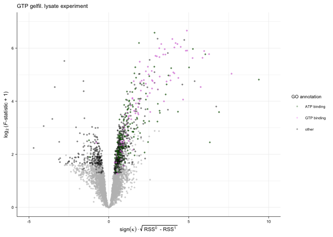
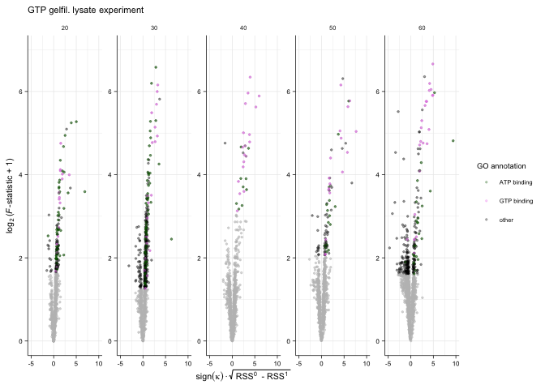
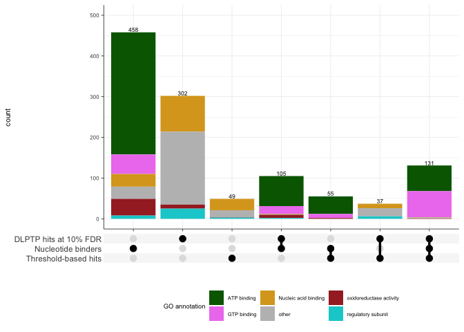

Analysis of GTP dataset
================
18 August, 2020

# Step-by-step walk through the anlysis

``` r
# This script uses the development version of TPP2D
if(require("BiocManager"))
  install.packages("BiocManager")
BiocManager::install("nkurzaw/TPP2D")
```

Load required libraries

``` r
library(TPP2D)
```

    ## Loading required package: dplyr

    ## 
    ## Attaching package: 'dplyr'

    ## The following objects are masked from 'package:stats':
    ## 
    ##     filter, lag

    ## The following objects are masked from 'package:base':
    ## 
    ##     intersect, setdiff, setequal, union

``` r
library(tidyverse)
```

    ## ── Attaching packages ───────────────────────────────────────────── tidyverse 1.3.0 ──

    ## ✓ ggplot2 3.3.2     ✓ purrr   0.3.4
    ## ✓ tibble  3.0.1     ✓ stringr 1.4.0
    ## ✓ tidyr   1.1.0     ✓ forcats 0.5.0
    ## ✓ readr   1.3.1

    ## ── Conflicts ──────────────────────────────────────────────── tidyverse_conflicts() ──
    ## x dplyr::filter() masks stats::filter()
    ## x dplyr::lag()    masks stats::lag()

``` r
library(ggplot2)
library(readxl)
library(ggupset)
```

    ## Warning: package 'ggupset' was built under R version 4.0.2

Define plot style

``` r
theme_paper <- theme_bw(base_size = 6) +
  theme(legend.background = element_blank(), 
        legend.key = element_blank(), 
        panel.background = element_blank(), 
        panel.grid.major = element_line(colour = "grey92", size = 0.25),
        panel.grid.minor = element_line(colour = "grey92", size = 0.15),
        panel.border = element_blank(), 
        strip.background = element_blank(), 
        plot.background = element_blank(), 
        complete = TRUE,
        axis.line = element_line(color = "black", size = 0.25),
        text = element_text(size = 7),
        axis.ticks = element_line(color = "black", size = 0.25),
        axis.title = element_text(size = 8),
        axis.text = element_text(size = 6))
```

Annotate proteins groups

``` r
all_atp_binder <- AnnotationDbi::select(
  org.Hs.eg.db::org.Hs.eg.db, 
  keys = "GO:0005524", 
  columns = c("SYMBOL", "IPI"), 
  keytype = "GOALL")
```

    ## 

    ## 'select()' returned 1:many mapping between keys and columns

``` r
all_gtp_binder <- AnnotationDbi::select(
  org.Hs.eg.db::org.Hs.eg.db, 
  keys = "GO:0005525", 
  columns = c("SYMBOL", "IPI"), 
  keytype = "GOALL")
```

    ## 'select()' returned 1:many mapping between keys and columns

``` r
all_gtpase_activity <- AnnotationDbi::select(
  org.Hs.eg.db::org.Hs.eg.db, 
  keys = "GO:0003924", 
  columns = c("SYMBOL", "IPI"), 
  keytype = "GOALL")
```

    ## 'select()' returned 1:many mapping between keys and columns

``` r
all_nucleotide_binder <- AnnotationDbi::select(
  org.Hs.eg.db::org.Hs.eg.db, 
  keys = "GO:0000166", 
  columns = c("SYMBOL", "IPI"), 
  keytype = "GOALL")
```

    ## 'select()' returned 1:many mapping between keys and columns

``` r
all_nucleic_acid_binder <- AnnotationDbi::select(
  org.Hs.eg.db::org.Hs.eg.db, 
  keys = "GO:0003676", 
  columns = c("SYMBOL", "IPI"), 
  keytype = "GOALL")
```

    ## 'select()' returned 1:many mapping between keys and columns

``` r
all_enzyme_regulator <- AnnotationDbi::select(
  org.Hs.eg.db::org.Hs.eg.db, 
  keys = "GO:0030234", 
  columns = c("SYMBOL", "IPI"), 
  keytype = "GOALL")
```

    ## 'select()' returned 1:many mapping between keys and columns

``` r
all_oxidoreductases <- AnnotationDbi::select(
  org.Hs.eg.db::org.Hs.eg.db, 
  keys = "GO:0016491", 
  columns = c("SYMBOL", "IPI"), 
  keytype = "GOALL")
```

    ## 'select()' returned 1:many mapping between keys and columns

Download the supplementary table from the journal’s website

``` r
# if(!file.exists("Supplementary_Data_3.xlsx")){
#   download.file(
#     url = "https://www.biorxiv.org/content/biorxiv/early/2020/05/09/2020.05.08.083709/DC2/embed/media-3.xlsx?download=true",
#     destfile = "Supplementary_Data_3.xlsx",
#     mode = "wb")
# }
# needs to be replaced with new table from Journal
```

Read in the data and reformat to a data frame as would be obtained after
import of the raw data:

``` r
gtp_raw <- read_xlsx("Supplementary_Data_3.xlsx", sheet = "GTP") %>% 
  dplyr::select(representative,
                clustername,
                qupm,
                qusm,
                experiment,
                temperature,
                matches("sumionarea"),
                matches("rel_fc_protein"))  %>% 
  gather(key, value, matches("sumionarea"), matches("rel_fc_protein")) %>% 
  mutate(conc = as.numeric(gsub("uM", "", gsub(".+_protein_[0-9,H,L]+_[0-9,H,L]+_", "", key))),
         temperature = as.numeric(gsub("C", "", temperature)),
         key = case_when(grepl("sumionarea", key) ~ "raw_value",
                         grepl("rel_fc", key) ~ "rel_value")) %>% 
  spread(key, value) %>% 
  arrange(representative, temperature, conc) %>% 
  group_by(clustername, temperature, conc) %>% 
  filter(qupm == max(qupm), 
         qusm == max(qusm), 
         raw_value == max(raw_value)) %>% 
  filter(!duplicated(clustername)) %>% 
  ungroup %>% 
  mutate(log2_value = log2(raw_value),
         log_conc = log10(conc/1e6)) %>% 
  filter(qupm > 1)

# resolve ambiguous protein names
gtp_fil <- resolveAmbiguousProteinNames(gtp_raw)
  
# recompute reporter ion signal from robust Isobarquant fold changes
gtp_df <- recomputeSignalFromRatios(gtp_fil)
```

Compute null and alternative model fits and extract parameters

``` r
gtp_params_df <- getModelParamsDf(gtp_df, maxit = 500)
saveRDS(gtp_params_df, file = "../pre_run_data/gtp_params_df.rds")
```

Compute *F*-statistics

``` r
gtp_fstat_df <- computeFStatFromParams(gtp_params_df)
```

Get \(B\) datasets expected under the null model and perform model
fitting and compute F statistics to obtain a null distribution for FDR
calibration:

``` r
set.seed(12, kind = "L'Ecuyer-CMRG")
gtp_null_df <- bootstrapNullAlternativeModel(
  df = gtp_df, params_df = gtp_params_df, 
  maxit = 500, B = 100,
  BPPARAM = BiocParallel::MulticoreParam(workers = 20, progressbar = TRUE),
  verbose = FALSE)
saveRDS(gtp_null_df, file = "../pre_run_data/gtp_null_df.rds")
```

Compute FDR and find hits:

``` r
gtp_fdr_df <- getFDR(df_out = gtp_fstat_df,
                     df_null = gtp_null_df,
                     squeezeDenominator = TRUE) %>% 
  mutate(clustername = gsub("^SEPT", "SEPTIN", clustername))
  
gtp_hits_df <- findHits(gtp_fdr_df, alpha = 0.1)
```

``` r
ggplot(gtp_fdr_df %>% 
         filter(dataset == "true"), 
       aes(sign(slopeH1)*sqrt(rssH0 - rssH1), log2(F_statistic + 1))) +
  geom_point(color = "gray", alpha = 0.5, size = 0.5) + 
  geom_point(aes(color = group), 
             alpha = 0.25, 
             size = 0.5,
             data = gtp_hits_df %>% 
               mutate(group = case_when(
                 clustername %in% all_gtp_binder$SYMBOL ~ "GTP binding",
                 clustername %in% all_atp_binder$SYMBOL ~ "ATP binding",
                 TRUE ~ "other"))) +
  geom_point(color = "darkgreen", 
             alpha = 0.25,
             size = 0.5,
             data = filter(gtp_hits_df, clustername %in%
                             all_atp_binder$SYMBOL)) +
  geom_point(color = "violet", 
             alpha = 0.25,
             size = 0.5,
             data = filter(gtp_hits_df, clustername %in%
                             all_gtp_binder$SYMBOL)) +
  scale_color_manual("GO annotation", values = c(
    "GTP binding" = "violet",
    "ATP binding" = "darkgreen",
    "other" = "black"
  )) +
  labs(x = bquote(sign(kappa) %.% sqrt(~'RSS'^0~' - RSS'^1~'')),
       y = expression('log'[2]~'('*italic(F)*'-statistic + 1)')) +
  coord_cartesian(xlim = c(-5, 10), ylim = c(0, 7)) +
  ggtitle("GTP gelfil. lysate experiment") +
  theme_paper
```



``` r
ggplot(gtp_fdr_df %>% 
         filter(dataset == "true"), 
       aes(sign(slopeH1)*sqrt(rssH0 - rssH1), log2(F_statistic + 1))) +
  geom_point(color = "gray", alpha = 0.5, size = 0.5) + 
  geom_point(aes(color = group), 
             alpha = 0.25, 
             size = 0.5,
             data = gtp_hits_df %>% 
               mutate(group = case_when(
                 clustername %in% all_gtp_binder$SYMBOL ~ "GTP binding",
                 clustername %in% all_atp_binder$SYMBOL ~ "ATP binding",
                 TRUE ~ "other"))) +
  geom_point(color = "darkgreen", 
             alpha = 0.25,
             size = 0.5,
             data = filter(gtp_hits_df, clustername %in%
                             all_atp_binder$SYMBOL)) +
  geom_point(color = "violet", 
             alpha = 0.25,
             size = 0.5,
             data = filter(gtp_hits_df, clustername %in%
                             all_gtp_binder$SYMBOL)) +
  scale_color_manual("GO annotation", values = c(
    "GTP binding" = "violet",
    "ATP binding" = "darkgreen",
    "other" = "black"
  )) +
  facet_wrap(~nObsRound, scales = "free", ncol = 5) +
  labs(x = bquote(sign(kappa) %.% sqrt(~'RSS'^0~' - RSS'^1~'')),
       y = expression('log'[2]~'('*italic(F)*'-statistic + 1)')) +
  coord_cartesian(xlim = c(-5, 10), ylim = c(0, 7)) +
  ggtitle("GTP gelfil. lysate experiment") +
  theme_paper
```



# Compare sets

``` r
gtp_threshold_df <- read_xlsx("Supplementary_Data_3.xlsx", sheet = "GTP") %>% 
  dplyr::select(clustername, stabilized_hits_found_by_threshold) %>% 
  filter(stabilized_hits_found_by_threshold) %>% 
  mutate(clustername = gsub("^SEPT", "SEPTIN", clustername)) 

gtp_hits_10per <- gtp_hits_df %>% 
  filter(detected_effectH1 == "stability", slopeH1 > 0)

atp_binder_in_dataset <- unique(intersect(all_atp_binder$SYMBOL,
                                          gtp_fdr_df$clustername))
gtp_binder_in_dataset <- unique(intersect(all_gtp_binder$SYMBOL,
                                          gtp_fdr_df$clustername))
nucleotide_binder_in_dataset <- unique(intersect(all_nucleotide_binder$SYMBOL,
                                                 gtp_fdr_df$clustername))
nucleic_acid_binder_in_dataset <- unique(intersect(all_nucleic_acid_binder$SYMBOL,
                                                   gtp_fdr_df$clustername))
reg_subunit_in_dataset <- unique(intersect(all_enzyme_regulator$SYMBOL,
                                           gtp_fdr_df$clustername))
set_intersect_df <- data.frame(
  gene_name = filter(gtp_fdr_df, !duplicated(clustername))$clustername) %>% 
  mutate(
    `Nucleotide binders` = as.numeric(
      gene_name %in% nucleotide_binder_in_dataset),
    `DLPTP hits at 10% FDR` = as.numeric(
      gene_name %in% gtp_hits_10per$clustername),
    `Threshold-based hits` = as.numeric(
      gene_name %in% gtp_threshold_df$clustername))


fill_colors <- c("ATP binding" = "darkgreen",
                 "GTP binding" = "violet",
                 "Nucleic acid binding" = "goldenrod",
                 "regulatory subunit" = "darkturquoise",
                 "oxidoreductase activity" = "brown",
                 "other" = "gray")

tidy_set_df <- set_intersect_df %>% 
  as_tibble() %>% 
  gather(key, value, -gene_name) %>% 
  filter(value == 1) %>% 
  dplyr::select(-value) %>% 
  group_by(gene_name) %>%
  summarise(set = list(key)) %>% 
  ungroup() %>% 
  mutate(set_collapsed = factor(
    sapply(set, function(x) paste0(sort(x), collapse="_")),
    levels = c("Nucleotide binders", "DLPTP hits at 10% FDR",
               "Threshold-based hits",
               "DLPTP hits at 10% FDR_Nucleotide binders",
               "Nucleotide binders_Threshold-based hits",
               "DLPTP hits at 10% FDR_Threshold-based hits",
               "DLPTP hits at 10% FDR_Nucleotide binders_Threshold-based hits"))) %>% 
  mutate(detail_set = case_when(
    gene_name %in% gtp_binder_in_dataset | gene_name %in% all_gtpase_activity$SYMBOL ~ "GTP binding",
    gene_name %in% atp_binder_in_dataset ~ "ATP binding",
    gene_name %in% nucleic_acid_binder_in_dataset ~ "Nucleic acid binding",
    gene_name %in% reg_subunit_in_dataset ~ "regulatory subunit",
    gene_name %in% all_oxidoreductases$SYMBOL ~ "oxidoreductase activity",
    TRUE ~ "other"))
```

    ## `summarise()` ungrouping output (override with `.groups` argument)

``` r
ggplot(tidy_set_df, aes(x = set_collapsed)) +
  geom_bar(aes(fill = detail_set)) +
  geom_text(stat = "count",
    aes(label = ..count.., vjust = -0.2), 
    size = 2.25,
    inherit.aes = TRUE) +
  scale_y_continuous(limits = c(0, 500)) +
  axis_combmatrix(sep = "_") +
  scale_fill_manual("GO annotation", values = fill_colors) +
  xlab("") +
  theme(legend.background = element_blank(), 
        legend.key = element_blank(), 
        legend.position = "bottom",
        panel.background = element_blank(), 
        panel.grid.major = element_line(colour = "grey92", size = 0.25),
        panel.grid.minor = element_line(colour = "grey92", size = 0.15),
        panel.border = element_blank(), 
        strip.background = element_blank(), 
        plot.background = element_blank(), 
        #complete = TRUE,
        axis.line = element_line(color = "black", size = 0.25),
        text = element_text(size = 7),
        axis.ticks = element_line(color = "black", size = 0.25),
        axis.title = element_text(size = 8),
        axis.text = element_text(size = 6))
```



``` r
gtp_max_fc_df <- gtp_df %>% 
  filter(clustername %in% gtp_params_df$clustername) %>% 
  group_by(clustername) %>% 
  summarise(max_fc = max(rel_value)) %>% 
  mutate(DLPTP = clustername %in% gtp_hits_10per$clustername,
         `Threshold-based approach` = clustername %in% 
           gtp_threshold_df$clustername) %>% 
  gather(key, value, -clustername, -max_fc) %>% 
  filter(clustername %in% all_nucleotide_binder$SYMBOL) %>% 
  filter(value)
```

    ## `summarise()` ungrouping output (override with `.groups` argument)

``` r
ggplot(gtp_max_fc_df, aes(log2(max_fc))) +
  geom_histogram(fill = "steelblue", 
                 alpha = 0.25,
                 data = filter(gtp_max_fc_df, key == "DLPTP"),
                position = "dodge",
                bins = 75) +
  geom_histogram(fill = "darkorange", 
                 alpha = 0.25,
                 data = filter(gtp_max_fc_df, key != "DLPTP"),
                 position = "dodge",
                 bins = 75) +
  geom_vline(xintercept = log2(1.5), 
             linetype = "dashed",
             color = "gray") +
  xlab(bquote(
    'max. log'[2]~'fold change per signif. stabilized nucleotide binder')) +
  theme_paper +
  theme(legend.position = c(0.75, 0.75))
```


``` r
sessionInfo()
```

    ## R version 4.0.0 Patched (2020-05-04 r78358)
    ## Platform: x86_64-apple-darwin17.0 (64-bit)
    ## Running under: macOS Mojave 10.14.6
    ## 
    ## Matrix products: default
    ## BLAS:   /Library/Frameworks/R.framework/Versions/4.0/Resources/lib/libRblas.dylib
    ## LAPACK: /Library/Frameworks/R.framework/Versions/4.0/Resources/lib/libRlapack.dylib
    ## 
    ## locale:
    ## [1] en_US.UTF-8/en_US.UTF-8/en_US.UTF-8/C/en_US.UTF-8/en_US.UTF-8
    ## 
    ## attached base packages:
    ## [1] stats     graphics  grDevices utils     datasets  methods   base     
    ## 
    ## other attached packages:
    ##  [1] ggupset_0.3.0   readxl_1.3.1    forcats_0.5.0   stringr_1.4.0  
    ##  [5] purrr_0.3.4     readr_1.3.1     tidyr_1.1.0     tibble_3.0.1   
    ##  [9] ggplot2_3.3.2   tidyverse_1.3.0 TPP2D_1.5.7     dplyr_1.0.0    
    ## 
    ## loaded via a namespace (and not attached):
    ##  [1] Biobase_2.48.0       httr_1.4.1           bit64_0.9-7         
    ##  [4] jsonlite_1.6.1       foreach_1.5.0        modelr_0.1.8        
    ##  [7] assertthat_0.2.1     stats4_4.0.0         blob_1.2.1          
    ## [10] cellranger_1.1.0     yaml_2.2.1           pillar_1.4.4        
    ## [13] RSQLite_2.2.0        backports_1.1.7      lattice_0.20-41     
    ## [16] glue_1.4.1           limma_3.44.1         digest_0.6.25       
    ## [19] rvest_0.3.5          colorspace_1.4-1     htmltools_0.4.0     
    ## [22] pkgconfig_2.0.3      broom_0.5.6          haven_2.3.1         
    ## [25] scales_1.1.1         openxlsx_4.1.5       BiocParallel_1.22.0 
    ## [28] farver_2.0.3         IRanges_2.22.2       generics_0.0.2      
    ## [31] ellipsis_0.3.1       withr_2.2.0          BiocGenerics_0.34.0 
    ## [34] cli_2.0.2            magrittr_1.5         crayon_1.3.4        
    ## [37] memoise_1.1.0        evaluate_0.14        fs_1.4.1            
    ## [40] fansi_0.4.1          doParallel_1.0.15    nlme_3.1-148        
    ## [43] MASS_7.3-51.6        xml2_1.3.2           tools_4.0.0         
    ## [46] org.Hs.eg.db_3.11.4  hms_0.5.3            lifecycle_0.2.0     
    ## [49] S4Vectors_0.26.1     munsell_0.5.0        reprex_0.3.0        
    ## [52] zip_2.0.4            AnnotationDbi_1.50.0 compiler_4.0.0      
    ## [55] rlang_0.4.6          grid_4.0.0           RCurl_1.98-1.2      
    ## [58] iterators_1.0.12     rstudioapi_0.11      labeling_0.3        
    ## [61] bitops_1.0-6         rmarkdown_2.2        gtable_0.3.0        
    ## [64] codetools_0.2-16     DBI_1.1.0            R6_2.4.1            
    ## [67] lubridate_1.7.8      knitr_1.28           bit_1.1-15.2        
    ## [70] stringi_1.4.6        parallel_4.0.0       Rcpp_1.0.4.6        
    ## [73] vctrs_0.3.0          dbplyr_1.4.4         tidyselect_1.1.0    
    ## [76] xfun_0.14
