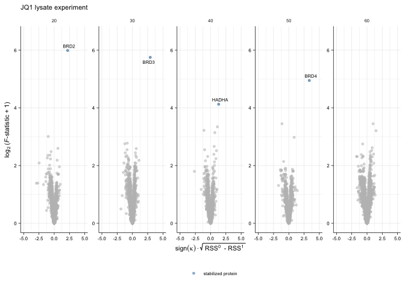
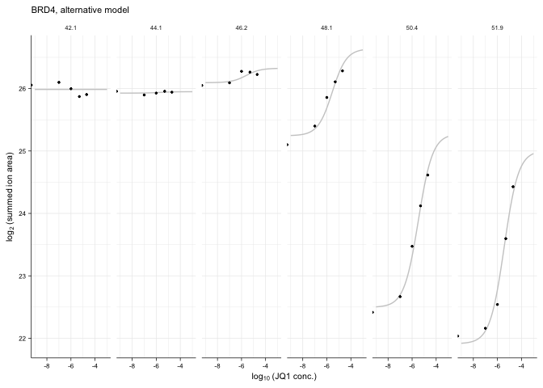

Re-analysis of JQ1 lysate dataset by Savitski et al, 2018
================
01 October, 2020

# Step-by-step walk through the `TPP2D` analysis

``` r
# This script uses the development version of TPP2D
if(require("BiocManager"))
  install.packages("BiocManager")
BiocManager::install("nkurzaw/TPP2D")
```

Load required libraries

``` r
library(TPP2D)
```

    ## Loading required package: dplyr

    ## 
    ## Attaching package: 'dplyr'

    ## The following objects are masked from 'package:stats':
    ## 
    ##     filter, lag

    ## The following objects are masked from 'package:base':
    ## 
    ##     intersect, setdiff, setequal, union

``` r
library(dplyr)
library(tidyr)
library(ggplot2)
library(readxl)
library(gplots)
```

    ## 
    ## Attaching package: 'gplots'

    ## The following object is masked from 'package:stats':
    ## 
    ##     lowess

Define plot style

``` r
theme_paper <- theme_bw(base_size = 6) +
  theme(legend.background = element_blank(), 
        legend.key = element_blank(), 
        panel.background = element_blank(), 
        panel.grid.major = element_line(colour = "grey92", size = 0.25),
        panel.grid.minor = element_line(colour = "grey92", size = 0.15),
        panel.border = element_blank(), 
        strip.background = element_blank(), 
        plot.background = element_blank(), 
        complete = TRUE,
        axis.line = element_line(color = "black", size = 0.25),
        text = element_text(size = 7),
        axis.ticks = element_line(color = "black", size = 0.25),
        axis.title = element_text(size = 8),
        axis.text = element_text(size = 6))
```

Download the supplementary excel table (Supplementary Dataset S1) by
Savitski et al. (2018)

``` r
if(!file.exists("Savitski_et_al_Figure_3/Supplementary Dataset 2_2D-TPP.xlsx")){
    download.file(
      url = "https://data.mendeley.com/datasets/8pzhg2tdyb/1/files/115f60c9-01d1-4213-9abb-aa095d70a626/Savitski%20et%20al%20Figure%203.zip?dl=1",
      destfile = "Savitski_et_al_Figure_3.zip",
        mode = "wb") 
    unzip(zipfile = "Savitski_et_al_Figure_3.zip", 
        exdir = "Savitski_et_al_Figure_3")
    system("rm Savitski_et_al_Figure_3.zip")
}
```

Read in the data and reformat to a data frame as would be obtained after
import of the raw data:

``` r
jq1_lys_raw <- read_xlsx("Savitski_et_al_Figure_3/Supplementary Dataset 2_2D-TPP.xlsx", sheet = 3, skip = 1) %>% 
  dplyr::select(representative = `Accession No.`,
                clustername = `protein name`,
                qupm = QUPM,
                qusm = QUSM,
                temperature,
                matches("sumionarea"),
                -matches("total"),
                matches("rel_fc_protein"),
                -matches("transformed"),
                -matches("orig"))  %>% 
  gather(key, value, matches("sumionarea"), matches("rel_fc_protein")) %>% 
  mutate(conc = as.numeric(gsub("uM", "", gsub(".+_protein_[0-9,H,L]+_[0-9,H,L]+_", "", key))),
         temperature = as.numeric(gsub("C", "", temperature)),
         key = case_when(grepl("sumionarea", key) ~ "raw_value",
                         grepl("rel_fc", key) ~ "rel_value")) %>% 
  spread(key, value) %>% 
  arrange(representative, temperature, conc) %>% 
  group_by(clustername, temperature, conc) %>% 
  filter(qupm == max(qupm), 
         qusm == max(qusm), 
         raw_value == max(raw_value)) %>% 
  filter(!duplicated(clustername)) %>% 
  ungroup %>% 
  mutate(log2_value = log2(raw_value),
         log_conc = log10(conc/1e6)) %>% 
  filter(qupm > 1)

# resolve ambiguous protein names
jq1_lys_fil <- resolveAmbiguousProteinNames(jq1_lys_raw)
  
# recompute reporter ion signal from robust Isobarquant fold changes
jq1_lys_df <- recomputeSignalFromRatios(jq1_lys_fil)
```

Compute null and alternative model fits and extract parameters

``` r
jq1_params_df <- getModelParamsDf(jq1_lys_df, maxit = 500)
saveRDS(jq1_params_df, file = "../pre_run_data/jq1_params_df.rds")
```

Compute *F*-statistics

``` r
jq1_fstat_df <- computeFStatFromParams(jq1_params_df)
```

Get \(B\) datasets expected under the null model and perform model
fitting and compute F statistics to obtain a null distribution for FDR
calibration:

``` r
set.seed(12, kind = "L'Ecuyer-CMRG")
jq1_null_df <- bootstrapNullAlternativeModel(
  df = jq1_lys_df, params_df = jq1_params_df, 
  maxit = 500, B = 100,
  BPPARAM = BiocParallel::MulticoreParam(workers = 20, progressbar = TRUE),
  verbose = FALSE)
saveRDS(jq1_null_df, file = "../pre_run_data/jq1_null_df.rds")
```

Compute FDR and find hits:

``` r
jq1_fdr_df <- getFDR(df_out = jq1_fstat_df,
                     df_null = jq1_null_df,
                     squeezeDenominator = TRUE)
  
jq1_hits_df <- findHits(jq1_fdr_df, alpha = 0.1)
```

``` r
ggplot(jq1_fdr_df %>% 
           filter(dataset == "true") %>% 
           mutate(group = case_when(slopeH1 > 0 ~ "stabilized protein",
                                    slopeH1 < 0 ~ "destabilized protein")), 
       aes(sign(slopeH1)*sqrt(rssH0 - rssH1), log2(F_statistic + 1))) +
  geom_point(color = "gray", alpha = 0.5, size = 1) + 
  geom_point(aes(color = group), alpha = 0.5, 
             size = 1,
             data = jq1_hits_df %>% 
                 mutate(group = case_when(
                     slopeH1 > 0 ~ "stabilized protein",
                     slopeH1 < 0 ~ "destabilized protein"))) + 
  ggrepel::geom_text_repel(
    aes(label = clustername),
    data = jq1_hits_df, 
    size = 2, segment.size = 0.2, min.segment.length = unit(2, "pt")) +
  scale_color_manual("", values = c("steelblue", "orange")) +
  labs(x = bquote(sign(kappa) %.% sqrt(~'RSS'^0~' - RSS'^1~'')),
       y = expression('log'[2]~'('*italic(F)*'-statistic + 1)')) +
  ggtitle("JQ1 lysate experiment") +
  coord_cartesian(xlim = c(-5, 5), 
                  ylim = c(0, 6.5)) +
  theme_paper +
  theme(legend.position = "bottom")
```


``` r
ggplot(jq1_fdr_df %>% 
           filter(dataset == "true") %>% 
           mutate(group = case_when(slopeH1 > 0 ~ "stabilized protein",
                                    slopeH1 < 0 ~ "destabilized protein")), 
       aes(sign(slopeH1)*sqrt(rssH0 - rssH1), log2(F_statistic + 1))) +
  geom_point(color = "gray", alpha = 0.5, size = 1) + 
  geom_point(aes(color = group), alpha = 0.5, 
             size = 1,
             data = jq1_hits_df %>% 
                 mutate(group = case_when(
                     slopeH1 > 0 ~ "stabilized protein",
                     slopeH1 < 0 ~ "destabilized protein"))) + 
  ggrepel::geom_text_repel(
    aes(label = clustername),
    data = jq1_hits_df, 
    size = 2, segment.size = 0.2, min.segment.length = unit(2, "pt")) +
  scale_color_manual("", values = c("steelblue", "orange")) +
  facet_wrap(~nObsRound, scales = "free", ncol = 5) +
  labs(x = bquote(sign(kappa) %.% sqrt(~'RSS'^0~' - RSS'^1~'')),
       y = expression('log'[2]~'('*italic(F)*'-statistic + 1)')) +
  ggtitle("JQ1 lysate experiment") +
  coord_cartesian(xlim = c(-5, 5), ylim = c(0, 6.5)) +
  theme_paper +
  theme(legend.position = "bottom")
```



# Compare to previous analysis

``` r
jq1_thres_df <- read_xlsx("Savitski_et_al_Figure_3/Supplementary Dataset 2_2D-TPP.xlsx", sheet = 3, skip = 1) %>% 
  filter(QUPM > 1)

#stabilization
venn(list("DLPTP" = (jq1_hits_df %>% filter(slopeH1 > 0))$clustername,
          "threshold-based" = (jq1_thres_df %>% filter(protein_stabilized_neighb_temp_good_curves_count > 1) %>% filter(!duplicated(`protein name`)))$`protein name`))
```


``` r
#destabilization
venn(list("DLPTP" = (jq1_hits_df %>% filter(slopeH1 < 0))$clustername,
          "threshold-based" = (jq1_thres_df %>% filter(protein_destabilized_neighb_temp_good_curves_count > 1) %>% filter(!duplicated(`protein name`)))$`protein name`))
```


# Plot example profiles

BRD4

``` r
brd4_fit <- plot2dTppFit(jq1_lys_df, "BRD4", "H1")$data

brd4_df <- filter(jq1_lys_df, clustername == "BRD4")

ggplot(brd4_fit, aes(log_conc, y_hat)) +
  geom_line(color = "gray80") +
  geom_point(aes(log_conc, log2_value), 
             data = brd4_df, size = 0.5) +
  facet_wrap(~temperature, ncol = 6) +
  labs(x = expression('log'[10]~ '(JQ1 conc.)'),
       y = expression('log'[2]~ '(summed ion area)')) +
  ggtitle("BRD4, alternative model") +
  theme_paper
```


BRD3

``` r
brd3_fit <- plot2dTppFit(jq1_lys_df, "BRD3", "H1")$data

brd3_df <- filter(jq1_lys_df, clustername == "BRD3")

ggplot(brd3_fit, aes(log_conc, y_hat)) +
  geom_line(color = "gray80") +
  geom_point(aes(log_conc, log2_value), 
             data = brd3_df, size = 0.5) +
  facet_wrap(~temperature, ncol = 6) +
  labs(x = expression('log'[10]~ '(JQ1 conc.)'),
       y = expression('log'[2]~ '(summed ion area)')) +
  ggtitle("BRD4, alternative model") +
  theme_paper
```



``` r
sessionInfo()
```

    ## R version 4.0.0 Patched (2020-05-04 r78358)
    ## Platform: x86_64-apple-darwin17.0 (64-bit)
    ## Running under: macOS Mojave 10.14.6
    ## 
    ## Matrix products: default
    ## BLAS:   /Library/Frameworks/R.framework/Versions/4.0/Resources/lib/libRblas.dylib
    ## LAPACK: /Library/Frameworks/R.framework/Versions/4.0/Resources/lib/libRlapack.dylib
    ## 
    ## locale:
    ## [1] en_US.UTF-8/en_US.UTF-8/en_US.UTF-8/C/en_US.UTF-8/en_US.UTF-8
    ## 
    ## attached base packages:
    ## [1] stats     graphics  grDevices utils     datasets  methods   base     
    ## 
    ## other attached packages:
    ## [1] gplots_3.0.3  readxl_1.3.1  ggplot2_3.3.2 tidyr_1.1.0   TPP2D_1.5.11 
    ## [6] dplyr_1.0.0  
    ## 
    ## loaded via a namespace (and not attached):
    ##  [1] zip_2.0.4           Rcpp_1.0.4.6        cellranger_1.1.0   
    ##  [4] pillar_1.4.4        compiler_4.0.0      bitops_1.0-6       
    ##  [7] iterators_1.0.12    tools_4.0.0         digest_0.6.25      
    ## [10] evaluate_0.14       lifecycle_0.2.0     tibble_3.0.1       
    ## [13] gtable_0.3.0        pkgconfig_2.0.3     rlang_0.4.6        
    ## [16] openxlsx_4.1.5      foreach_1.5.0       ggrepel_0.8.2      
    ## [19] yaml_2.2.1          parallel_4.0.0      xfun_0.14          
    ## [22] withr_2.2.0         stringr_1.4.0       knitr_1.28         
    ## [25] caTools_1.18.0      gtools_3.8.2        generics_0.0.2     
    ## [28] vctrs_0.3.0         grid_4.0.0          tidyselect_1.1.0   
    ## [31] glue_1.4.1          R6_2.4.1            BiocParallel_1.22.0
    ## [34] rmarkdown_2.2       gdata_2.18.0        limma_3.44.1       
    ## [37] farver_2.0.3        purrr_0.3.4         magrittr_1.5       
    ## [40] scales_1.1.1        codetools_0.2-16    ellipsis_0.3.1     
    ## [43] htmltools_0.5.0     MASS_7.3-51.6       colorspace_1.4-1   
    ## [46] labeling_0.3        KernSmooth_2.23-17  stringi_1.4.6      
    ## [49] RCurl_1.98-1.2      munsell_0.5.0       doParallel_1.0.15  
    ## [52] crayon_1.3.4

# References

<div id="refs" class="references">

<div id="ref-Savitski2018">

Savitski, M.M., Zinn, N., Faelth-Savitski, M., Poeckel, D., Gade, S.,
Becher, I., Muelbaier, M., Wagner, A.J., Strohmer, K., Werner, T., et
al. (2018). Multiplexed Proteome Dynamics Profiling Reveals Mechanisms
Controlling Protein Homeostasis. Cell 1–15.

</div>

</div>
