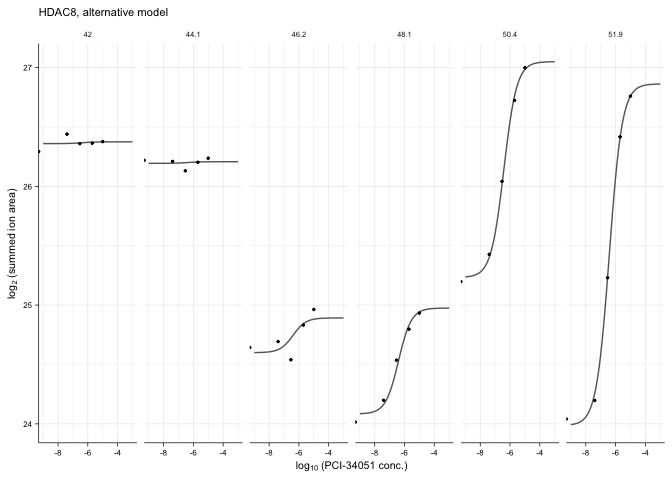
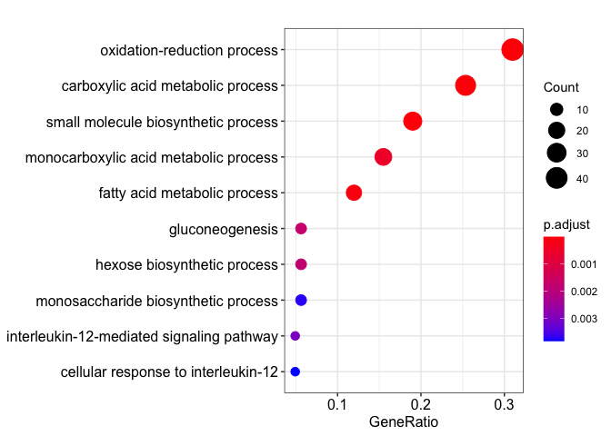

Analysis of PCI-34051 dataset
================
29 September, 2020

# Step-by-step walk through the `TPP2D` analysis

``` r
# This script uses the development version of TPP2D
if(require("BiocManager"))
  install.packages("BiocManager")
BiocManager::install("nkurzaw/TPP2D")
```

Load required libraries

``` r
library(TPP2D)
```

    ## Loading required package: dplyr

    ## 
    ## Attaching package: 'dplyr'

    ## The following objects are masked from 'package:stats':
    ## 
    ##     filter, lag

    ## The following objects are masked from 'package:base':
    ## 
    ##     intersect, setdiff, setequal, union

``` r
library(dplyr)
library(tidyr)
library(ggplot2)
library(readxl)
library(clusterProfiler)
```

    ## 

    ## clusterProfiler v3.16.0  For help: https://guangchuangyu.github.io/software/clusterProfiler
    ## 
    ## If you use clusterProfiler in published research, please cite:
    ## Guangchuang Yu, Li-Gen Wang, Yanyan Han, Qing-Yu He. clusterProfiler: an R package for comparing biological themes among gene clusters. OMICS: A Journal of Integrative Biology. 2012, 16(5):284-287.

    ## 
    ## Attaching package: 'clusterProfiler'

    ## The following object is masked from 'package:stats':
    ## 
    ##     filter

``` r
library(org.Hs.eg.db)
```

    ## Loading required package: AnnotationDbi

    ## Loading required package: stats4

    ## Loading required package: BiocGenerics

    ## Loading required package: parallel

    ## 
    ## Attaching package: 'BiocGenerics'

    ## The following objects are masked from 'package:parallel':
    ## 
    ##     clusterApply, clusterApplyLB, clusterCall, clusterEvalQ,
    ##     clusterExport, clusterMap, parApply, parCapply, parLapply,
    ##     parLapplyLB, parRapply, parSapply, parSapplyLB

    ## The following objects are masked from 'package:dplyr':
    ## 
    ##     combine, intersect, setdiff, union

    ## The following objects are masked from 'package:stats':
    ## 
    ##     IQR, mad, sd, var, xtabs

    ## The following objects are masked from 'package:base':
    ## 
    ##     anyDuplicated, append, as.data.frame, basename, cbind, colnames,
    ##     dirname, do.call, duplicated, eval, evalq, Filter, Find, get, grep,
    ##     grepl, intersect, is.unsorted, lapply, Map, mapply, match, mget,
    ##     order, paste, pmax, pmax.int, pmin, pmin.int, Position, rank,
    ##     rbind, Reduce, rownames, sapply, setdiff, sort, table, tapply,
    ##     union, unique, unsplit, which, which.max, which.min

    ## Loading required package: Biobase

    ## Welcome to Bioconductor
    ## 
    ##     Vignettes contain introductory material; view with
    ##     'browseVignettes()'. To cite Bioconductor, see
    ##     'citation("Biobase")', and for packages 'citation("pkgname")'.

    ## Loading required package: IRanges

    ## Loading required package: S4Vectors

    ## 
    ## Attaching package: 'S4Vectors'

    ## The following object is masked from 'package:clusterProfiler':
    ## 
    ##     rename

    ## The following object is masked from 'package:tidyr':
    ## 
    ##     expand

    ## The following objects are masked from 'package:dplyr':
    ## 
    ##     first, rename

    ## The following object is masked from 'package:base':
    ## 
    ##     expand.grid

    ## 
    ## Attaching package: 'IRanges'

    ## The following object is masked from 'package:clusterProfiler':
    ## 
    ##     slice

    ## The following objects are masked from 'package:dplyr':
    ## 
    ##     collapse, desc, slice

    ## 
    ## Attaching package: 'AnnotationDbi'

    ## The following object is masked from 'package:clusterProfiler':
    ## 
    ##     select

    ## The following object is masked from 'package:dplyr':
    ## 
    ##     select

    ## 

Define plot style

``` r
theme_paper <- theme_bw(base_size = 6) +
  theme(legend.background = element_blank(), 
        legend.key = element_blank(), 
        panel.background = element_blank(), 
        panel.grid.major = element_line(colour = "grey92", size = 0.25),
        panel.grid.minor = element_line(colour = "grey92", size = 0.15),
        panel.border = element_blank(), 
        strip.background = element_blank(), 
        plot.background = element_blank(), 
        complete = TRUE,
        axis.line = element_line(color = "black", size = 0.25),
        text = element_text(size = 7),
        axis.ticks = element_line(color = "black", size = 0.25),
        axis.title = element_text(size = 8),
        axis.text = element_text(size = 6))


theme_heat_paper <- 
  theme_minimal(base_size = 6) +
  theme(text = element_text(size = 7, color = "black"),
        axis.ticks = element_line(color = "black", size = 0.25),
        axis.title = element_text(size = 8),
        axis.text = element_text(size = 6, color = "black"))
```

Download the supplementary table from the journal’s website

``` r
if(!file.exists("Supplementary_Data_2.xlsx")){
  download.file(
    url = "https://www.biorxiv.org/content/biorxiv/early/2020/05/09/2020.05.08.083709/DC2/embed/media-2.xlsx?download=true",
    destfile = "Supplementary_Data_2.xlsx",
    mode = "wb")
}
```

Read in the data and reformat to a data frame as would be obtained after
import of the raw data:

``` r
pci_raw <- read_xlsx("Supplementary_Data_2.xlsx", sheet = "PCI34051") %>% 
  dplyr::select(representative,
                clustername,
                qupm,
                qusm,
                temperature,
                matches("sumionarea"),
                matches("rel_fc_protein"))  %>% 
  gather(key, value, matches("sumionarea"), matches("rel_fc_protein")) %>% 
  mutate(conc = as.numeric(gsub("uM", "", gsub(".+_protein_[0-9,H,L]+_[0-9,H,L]+_", "", key))),
         temperature = as.numeric(gsub("C", "", temperature)),
         key = case_when(grepl("sumionarea", key) ~ "raw_value",
                         grepl("rel_fc", key) ~ "rel_value")) %>% 
  spread(key, value) %>% 
  arrange(representative, temperature, conc) %>% 
  group_by(clustername, temperature, conc) %>% 
  filter(qupm == max(qupm), 
         qusm == max(qusm), 
         raw_value == max(raw_value)) %>% 
  filter(!duplicated(clustername)) %>% 
  ungroup %>% 
  mutate(log2_value = log2(raw_value),
         log_conc = log10(conc/1e6)) %>% 
  filter(qupm > 1)

# resolve ambiguous protein names
pci_fil <- resolveAmbiguousProteinNames(pci_raw)
  
# recompute reporter ion signal from robust Isobarquant fold changes
pci_df <- recomputeSignalFromRatios(pci_fil)
```

Compute null and alternative model fits and extract parameters

``` r
pci_params_df <- getModelParamsDf(pci_df, maxit = 500)
saveRDS(pci_params_df, file = "../pre_run_data/pci_params_df.rds")
```

Compute *F* statistics

``` r
pci_fstat_df <- computeFStatFromParams(pci_params_df)
```

Get \(B\) datasets expected under the null model and perform model
fitting and compute F statistics to obtain a null distribution for FDR
calibration:

``` r
set.seed(12, kind = "L'Ecuyer-CMRG")
pci_null_df <- bootstrapNullAlternativeModel(
  df = pci_lys_df, params_df = pci_params_df, 
  maxit = 500, B = 100,
  BPPARAM = BiocParallel::MulticoreParam(workers = 20, progressbar = TRUE),
  verbose = FALSE)
saveRDS(pci_null_df, file = "../pre_run_data/pci_null_df.rds")
```

Remove carry-over cases:

``` r
## manually identified carry-over cases
carry_over_cases <- 
c("ALDH1B1", "BTK", "CAMK2G", "CAMK2D", "CSK", "CSNK2A1", "CSNK2A2", 
  "GAK", "CSNK2B", "GSK3A", "LYN", "MAP4K1", "MAPK1", "MAPK9", "NEK9", 
  "NQO1", "PDXK", "PRKAA1", "PRKAG1", "RPS6KA1", "ULK3",
  "CDK2", "CDK5")
```

Compute FDR and find hits:

``` r
pci_fdr_df <- getFDR(df_out = pci_fstat_df %>% 
                         filter(!clustername %in% carry_over_cases),
                     df_null = pci_null_df %>% 
                         filter(!clustername %in% carry_over_cases),
                     squeezeDenominator = TRUE)
  
pci_hits_df <- findHits(pci_fdr_df, alpha = 0.1)
```

``` r
ggplot(pci_fdr_df %>% 
         filter(dataset == "true"), 
       aes(sign(slopeH1)*sqrt(rssH0 - rssH1), log2(F_statistic + 1))) +
  geom_point(color = "gray", alpha = 0.5, size = 1) + 
  geom_point(aes(color = group), alpha = 0.5, 
             size = 1,
             data = pci_hits_df %>% 
                 mutate(group = case_when(
                     slopeH1 > 0 ~ "stabilized protein",
                     slopeH1 < 0 ~ "destabilized protein"))) + 
  ggrepel::geom_text_repel(
    aes(label = clustername),
    data = filter(pci_hits_df, clustername %in% 
                    c("HDAC8", "LAP3")),
    size = 2, segment.size = 0.2, min.segment.length = unit(1, "pt")) +
  scale_color_manual("", values = c("orange", "steelblue")) +
  ylab("asinh(F statistic)") +
  labs(x = bquote(sign(kappa) %.% sqrt(~'RSS'^0~' - RSS'^1~'')),
       y = expression('log'[2]~'('*italic(F)*'-statistic + 1)')) +
  ggtitle("PCI-34051 in-cell experiment") +
  theme_paper +
  theme(legend.position = "bottom")
```


``` r
all_oxred_process <- AnnotationDbi::select(
  org.Hs.eg.db::org.Hs.eg.db, 
  keys = "GO:0055114", 
  columns = c("SYMBOL", "IPI"), 
  keytype = "GOALL")
```

    ## 'select()' returned 1:many mapping between keys and columns

``` r
all_carbred_process <- AnnotationDbi::select(
  org.Hs.eg.db::org.Hs.eg.db, 
  keys = "GO:0019752", 
  columns = c("SYMBOL", "IPI"), 
  keytype = "GOALL")
```

    ## 'select()' returned 1:many mapping between keys and columns

``` r
ggplot(pci_fdr_df %>% 
         filter(dataset == "true"), 
       aes(sign(slopeH1)*sqrt(rssH0 - rssH1), log2(F_statistic + 1))) +
  geom_point(color = "gray", alpha = 0.5) + 
  geom_point(aes(color = case_when(
    clustername %in% all_oxred_process$SYMBOL |
    clustername %in% all_carbred_process$SYMBOL ~ 
      "oxidation-reduction process or\ncarboxylic acid metabolic process",
    TRUE ~ "other")), 
             alpha = 0.5, 
             data = pci_hits_df) + 
  ggrepel::geom_text_repel(
    aes(label = clustername),
    data = filter(pci_hits_df, clustername %in% 
                    c("HDAC8", "LAP3")),
    size = 2, segment.size = 0.2, min.segment.length = unit(2, "pt")) +
  scale_color_manual("GO annotation", values = c("black", "darkturquoise")) +
  coord_cartesian(xlim = c(-5.5, 5.5)) + 
  facet_wrap(~nObsRound) +
  ylab("asinh(F statistic)") +
  labs(x = bquote(sign(kappa) %.% sqrt(~'RSS'^0~' - RSS'^1~'')),
       y = expression('log'[2]~'('*italic(F)*'-statistic + 1)')) +
  ggtitle("PCI-34051 in-cell experiment") +
  theme_paper +
  theme(legend.position = "bottom")
```


# Plot example profiles

HDAC8

``` r
hdac8_fit <- plot2dTppFit(pci_df, "HDAC8", "H1")$data

hdac8_df <- filter(pci_df, clustername == "HDAC8")

ggplot(hdac8_fit, aes(log_conc, y_hat)) +
  geom_line(color = "gray40") +
  geom_point(aes(log_conc, log2_value), 
             data = hdac8_df, size = 0.5) +
  facet_wrap(~temperature, ncol = 6) +
  labs(x = expression('log'[10]~ '(PCI-34051 conc.)'),
       y = expression('log'[2]~ '(summed ion area)')) +
  ggtitle("HDAC8, alternative model") +
  theme_paper
```



``` r
plot2dTppFcHeatmap(
  df = pci_df, name = "HDAC8",
  drug_name = "PCI-34051") + theme_heat_paper
```


LAP3

``` r
lap3_fit <- plot2dTppFit(pci_df, "LAP3", "H1")$data

lap3_df <- filter(pci_df, clustername == "LAP3")

ggplot(lap3_fit, aes(log_conc, y_hat)) +
  geom_line(color = "gray40") +
  geom_point(aes(log_conc, log2_value), 
             data = lap3_df, size = 0.5) +
  facet_wrap(~temperature, ncol = 6) +
  labs(x = expression('log'[10]~ '(PCI-34051 conc.)'),
       y = expression('log'[2]~ '(summed ion area)')) +
  ggtitle("LAP3, alternative model") +
  theme_paper
```


``` r
plot2dTppFcHeatmap(
  df = pci_df, name = "LAP3",
  drug_name = "PCI-34051") + theme_heat_paper
```


# GO analysis

We do this using the `clusterProfiler` package by Yu et al.

``` r
hits_entrez <- bitr(pci_hits_df$clustername, 
                fromType = "SYMBOL",
                toType = c("ENTREZID"),
                OrgDb = org.Hs.eg.db)
```

    ## 'select()' returned 1:1 mapping between keys and columns

    ## Warning in bitr(pci_hits_df$clustername, fromType = "SYMBOL", toType =
    ## c("ENTREZID"), : 11.98% of input gene IDs are fail to map...

``` r
backg_entrez <- bitr(pci_fdr_df$clustername, 
                     fromType = "SYMBOL",
                     toType = c("ENTREZID"),
                     OrgDb = org.Hs.eg.db)
```

    ## 'select()' returned 1:many mapping between keys and columns

    ## Warning in bitr(pci_fdr_df$clustername, fromType = "SYMBOL", toType =
    ## c("ENTREZID"), : 14.1% of input gene IDs are fail to map...

``` r
ego <- enrichGO(gene = hits_entrez$ENTREZID,
                universe = backg_entrez$ENTREZID,
                OrgDb = org.Hs.eg.db,
                ont = "BP",
                pAdjustMethod = "BH",
                pvalueCutoff = 0.01,
                qvalueCutoff = 0.05,
                readable = TRUE)

dotplot(ego)
```



``` r
sessionInfo()
```

    ## R version 4.0.0 Patched (2020-05-04 r78358)
    ## Platform: x86_64-apple-darwin17.0 (64-bit)
    ## Running under: macOS Mojave 10.14.6
    ## 
    ## Matrix products: default
    ## BLAS:   /Library/Frameworks/R.framework/Versions/4.0/Resources/lib/libRblas.dylib
    ## LAPACK: /Library/Frameworks/R.framework/Versions/4.0/Resources/lib/libRlapack.dylib
    ## 
    ## locale:
    ## [1] en_US.UTF-8/en_US.UTF-8/en_US.UTF-8/C/en_US.UTF-8/en_US.UTF-8
    ## 
    ## attached base packages:
    ## [1] parallel  stats4    stats     graphics  grDevices utils     datasets 
    ## [8] methods   base     
    ## 
    ## other attached packages:
    ##  [1] org.Hs.eg.db_3.11.4    AnnotationDbi_1.50.0   IRanges_2.22.2        
    ##  [4] S4Vectors_0.26.1       Biobase_2.48.0         BiocGenerics_0.34.0   
    ##  [7] clusterProfiler_3.16.0 readxl_1.3.1           ggplot2_3.3.2         
    ## [10] tidyr_1.1.0            TPP2D_1.5.10           dplyr_1.0.0           
    ## 
    ## loaded via a namespace (and not attached):
    ##  [1] bitops_1.0-6        enrichplot_1.8.1    bit64_0.9-7        
    ##  [4] progress_1.2.2      doParallel_1.0.15   RColorBrewer_1.1-2 
    ##  [7] httr_1.4.1          tools_4.0.0         R6_2.4.1           
    ## [10] DBI_1.1.0           colorspace_1.4-1    withr_2.2.0        
    ## [13] prettyunits_1.1.1   tidyselect_1.1.0    gridExtra_2.3      
    ## [16] bit_1.1-15.2        compiler_4.0.0      scatterpie_0.1.4   
    ## [19] xml2_1.3.2          labeling_0.3        triebeard_0.3.0    
    ## [22] scales_1.1.1        ggridges_0.5.2      stringr_1.4.0      
    ## [25] digest_0.6.25       rmarkdown_2.2       DOSE_3.14.0        
    ## [28] pkgconfig_2.0.3     htmltools_0.5.0     limma_3.44.1       
    ## [31] rlang_0.4.6         RSQLite_2.2.0       gridGraphics_0.5-0 
    ## [34] generics_0.0.2      farver_2.0.3        jsonlite_1.6.1     
    ## [37] BiocParallel_1.22.0 GOSemSim_2.14.0     zip_2.0.4          
    ## [40] RCurl_1.98-1.2      magrittr_1.5        ggplotify_0.0.5    
    ## [43] GO.db_3.11.4        Matrix_1.2-18       Rcpp_1.0.4.6       
    ## [46] munsell_0.5.0       viridis_0.5.1       lifecycle_0.2.0    
    ## [49] stringi_1.4.6       yaml_2.2.1          ggraph_2.0.3       
    ## [52] MASS_7.3-51.6       plyr_1.8.6          qvalue_2.20.0      
    ## [55] grid_4.0.0          blob_1.2.1          ggrepel_0.8.2      
    ## [58] DO.db_2.9           crayon_1.3.4        lattice_0.20-41    
    ## [61] graphlayouts_0.7.0  cowplot_1.0.0       splines_4.0.0      
    ## [64] hms_0.5.3           knitr_1.28          pillar_1.4.4       
    ## [67] fgsea_1.14.0        igraph_1.2.5        reshape2_1.4.4     
    ## [70] codetools_0.2-16    fastmatch_1.1-0     glue_1.4.1         
    ## [73] evaluate_0.14       downloader_0.4      BiocManager_1.30.10
    ## [76] data.table_1.12.8   urltools_1.7.3      vctrs_0.3.0        
    ## [79] tweenr_1.0.1        foreach_1.5.0       cellranger_1.1.0   
    ## [82] gtable_0.3.0        purrr_0.3.4         polyclip_1.10-0    
    ## [85] xfun_0.14           ggforce_0.3.1       openxlsx_4.1.5     
    ## [88] europepmc_0.4       tidygraph_1.2.0     viridisLite_0.3.0  
    ## [91] tibble_3.0.1        rvcheck_0.1.8       iterators_1.0.12   
    ## [94] memoise_1.1.0       ellipsis_0.3.1

# References

<div id="refs" class="references">

<div id="ref-Yu2012">

Yu, G., Wang, L., Han, Y., and He, Q. ClusterProfiler: An r package for
comparing biological themes among gene clusters. OMICS: A Journal of
Integrative Biology *16(5)*, 284–287.

</div>

</div>
