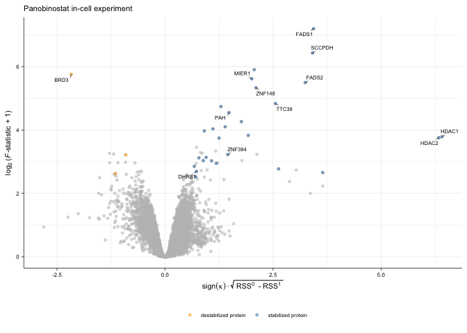
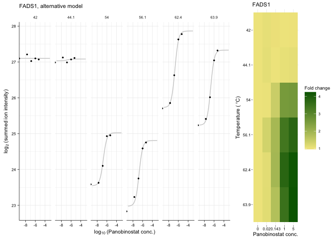

Re-analysis of Panobinostat in-cell dataset by Becher et al, 2016
================
true
24 June, 2020


# Step-by-step walk through the anlysis

``` r
# This script uses the development version of TPP2D
if(require("BiocManager"))
  install.packages("BiocManager")
BiocManager::install("nkurzaw/TPP2D")
```

Load required libraries

``` r
library(TPP2D)
```

    ## Loading required package: dplyr

    ## 
    ## Attaching package: 'dplyr'

    ## The following objects are masked from 'package:stats':
    ## 
    ##     filter, lag

    ## The following objects are masked from 'package:base':
    ## 
    ##     intersect, setdiff, setequal, union

``` r
library(dplyr)
library(tidyr)
library(ggplot2)
library(readxl)
library(gplots)
```

    ## 
    ## Attaching package: 'gplots'

    ## The following object is masked from 'package:stats':
    ## 
    ##     lowess

Define plot style

``` r
theme_paper <- theme_bw(base_size = 6) +
  theme(legend.background = element_blank(), 
        legend.key = element_blank(), 
        panel.background = element_blank(), 
        panel.grid.major = element_line(colour = "grey92", size = 0.25),
        panel.grid.minor = element_line(colour = "grey92", size = 0.15),
        panel.border = element_blank(), 
        strip.background = element_blank(), 
        plot.background = element_blank(), 
        complete = TRUE,
        axis.line = element_line(color = "black", size = 0.25),
        text = element_text(size = 7),
        axis.ticks = element_line(color = "black", size = 0.25),
        axis.title = element_text(size = 8),
        axis.text = element_text(size = 6))

theme_heat_paper <- 
  theme_minimal(base_size = 6) +
  theme(text = element_text(size = 7, color = "black"),
        axis.ticks = element_line(color = "black", size = 0.25),
        axis.title = element_text(size = 8),
        axis.text = element_text(size = 6, color = "black"))
```

Download the supplementary excel table (Supplementary Dataset S1) by
Becher et al. (2016)

``` r
if(!file.exists("41589_2016_BFnchembio2185_MOESM254_ESM.xlsx")){
download.file(
  url = "https://static-content.springer.com/esm/art%3A10.1038%2Fnchembio.2185/MediaObjects/41589_2016_BFnchembio2185_MOESM254_ESM.xlsx",
  destfile = "41589_2016_BFnchembio2185_MOESM254_ESM.xlsx") 
}
```

Read in the data and reformat to a data frame as would be obtained after
import of the raw data:

``` r
pano_cell_raw <- read_xlsx("41589_2016_BFnchembio2185_MOESM254_ESM.xlsx", 
                           sheet = 1, skip = 1) %>% 
  dplyr::select(representative,
                clustername,
                experiment = ms_experiment,
                qupm,
                qusm,
                temperature,
                matches("sumionarea"),
                -matches("total"),
                matches("rel_fc_protein"),
                -matches("transformed"),
                -matches("orig"),
                -matches("log2rel"))  %>% 
  gather(key, value, matches("sumionarea"), matches("rel_fc_protein")) %>% 
  mutate(conc = as.numeric(gsub("uM", "", gsub(".+_protein_[0-9,H,L]+_[0-9,H,L]+_", "", key))),
         temperature = as.numeric(gsub("C", "", temperature)),
         key = case_when(grepl("sumionarea", key) ~ "raw_value",
                         grepl("rel_fc", key) ~ "rel_value")) %>% 
  spread(key, value) %>% 
  arrange(representative, temperature, conc) %>% 
  group_by(clustername, temperature, conc) %>% 
  filter(qupm == max(qupm), 
         qusm == max(qusm), 
         raw_value == max(raw_value)) %>% 
  filter(!duplicated(clustername)) %>% 
  ungroup %>% 
  mutate(log2_value = log2(raw_value),
         log_conc = log10(conc/1e6)) %>% 
  filter(qupm > 1)

# resolve ambiguous protein names
pano_cell_fil <- resolveAmbiguousProteinNames(pano_cell_raw)
  
# recompute reporter ion signal from robust Isobarquant fold changes
pano_cell_df <- recomputeSignalFromRatios(pano_cell_fil)
```

Compute null and alternative model fits and extract parameters

``` r
pano_params_df <- getModelParamsDf(pano_cell_df, maxit = 500)
saveRDS(pano_params_df, file = "../pre_run_data/pano_params_df.rds")
```

Compute *F* statistics

``` r
pano_fstat_df <- computeFStatFromParams(pano_params_df)
```

Get \(B\) datasets expected under the null model and perform model
fitting and compute F statistics to obtain a null distribution for FDR
calibration:

``` r
set.seed(12, kind = "L'Ecuyer-CMRG")
pano_null_df <- bootstrapNullAlternativeModel(
  df = pano_cell_df, params_df = pano_params_df, 
  maxit = 500, B = 100,
  BPPARAM = BiocParallel::MulticoreParam(workers = 20, progressbar = TRUE),
  verbose = FALSE)
saveRDS(pano_null_df, file = "../pre_run_data/pano_null_df.rds")
```

Compute FDR and find hits:

``` r
pano_fdr_df <- getFDR(df_out = pano_fstat_df,
                     df_null = pano_null_df,
                     squeezeDenominator = TRUE)
  
pano_hits_df <- findHits(pano_fdr_df, alpha = 0.1)
```

``` r
ggplot(pano_fdr_df %>% 
           filter(dataset == "true") %>% 
           mutate(group = case_when(slopeH1 > 0 ~ "stabilized protein",
                                    slopeH1 < 0 ~ "destabilized protein")), 
       aes(log2(rssH0 - rssH1), asinh(F_statistic))) +
  geom_point(color = "gray", alpha = 0.5, size = 1) + 
  geom_point(aes(color = group), alpha = 0.5, 
             size = 1,
             data = pano_hits_df %>% 
                 mutate(group = case_when(
                     slopeH1 > 0 ~ "stabilized protein",
                     slopeH1 < 0 ~ "destabilized protein"))) + 
  ggrepel::geom_text_repel(
    aes(label = clustername),
    data = filter(pano_hits_df, clustername %in% 
                    c("HDAC1", "HDAC2",
                      "HDAC6", "PAH",
                      "TTC38", "FADS1",
                      "FADS2", "MIER1",
                      "BRD3", "SCCPDH",
                      "ZNF148", "DHRS1",
                      "ZNF384")),
    size = 2, segment.size = 0.2, min.segment.length = unit(2, "pt")) +
  scale_color_manual("", values = c("orange", "steelblue")) +
  labs(x = expression('log'[2]~'(RSS'^0~' - RSS'^1~')'),
       y = expression('asinh('*italic(F)*' statistic)')) +
  ggtitle("Panobinostat in-cell experiment") +
  coord_cartesian(xlim = c(-12.5, 7.5)) +
  theme_paper +
  theme(legend.position = "bottom")
```

<!-- -->

``` r
ggplot(pano_fdr_df %>% 
           filter(dataset == "true") %>% 
           mutate(group = case_when(slopeH1 > 0 ~ "stabilized protein",
                                    slopeH1 < 0 ~ "destabilized protein")), 
       aes(log2(rssH0 - rssH1), asinh(F_statistic))) +
  geom_point(color = "gray", alpha = 0.5, size = 1) + 
  geom_point(aes(color = group), alpha = 0.5, 
             size = 1,
             data = pano_hits_df %>% 
                 mutate(group = case_when(
                     slopeH1 > 0 ~ "stabilized protein",
                     slopeH1 < 0 ~ "destabilized protein"))) + 
  ggrepel::geom_text_repel(
    aes(label = clustername),
    data = filter(pano_hits_df, clustername %in% 
                    c("HDAC1", "HDAC2",
                      "HDAC6", "PAH",
                      "TTC38", "FADS1",
                      "FADS2", "MIER1",
                      "BRD3", "SCCPDH",
                      "ZNF148", "DHRS1",
                      "ZNF384")),
    size = 2, segment.size = 0.2, min.segment.length = unit(2, "pt")) +
  scale_color_manual("", values = c("orange", "steelblue")) +
  facet_wrap(~nObsRound, scales = "free", ncol = 5) +
  labs(x = expression('log'[2]~'(RSS'^0~' - RSS'^1~')'),
       y = expression('asinh('*italic(F)*' statistic)')) +
  ggtitle("Panobinostat in-cell experiment") +
  coord_cartesian(xlim = c(-12.5, 7.5)) +
  theme_paper +
  theme(legend.position = "bottom")
```

<!-- -->

# Compare to previous analysis

``` r
pano_thres_df <- read_xlsx("41589_2016_BFnchembio2185_MOESM254_ESM.xlsx", 
                          sheet = 1, skip = 1) %>% 
  filter(qupm > 1)

#stabilization
venn(list("DLPTP" = (pano_hits_df %>% filter(slopeH1 > 0))$clustername,
          "threshold-based" = (pano_thres_df %>% filter(protein_stabilized_neighb_temp_good_curves_count > 1) %>% filter(!duplicated(clustername)))$clustername))
```

<!-- -->

``` r
#destabilization
venn(list("DLPTP" = (pano_hits_df %>% filter(slopeH1 < 0))$clustername,
          "threshold-based" = (pano_thres_df %>% filter(protein_destabilized_neighb_temp_good_curves_count > 1) %>% filter(!duplicated(clustername)))$clustername))
```

<!-- -->

# Plot example profiles

HDAC6

``` r
hdac6_fit <- plot2dTppFit(pano_cell_df, "HDAC6", "H1")$data

hdac6_df <- filter(pano_cell_df, clustername == "HDAC6")

hdac6_thp <- ggplot(hdac6_fit, aes(log_conc, y_hat)) +
  geom_line(color = "gray80") +
  geom_point(aes(log_conc, log2_value), 
             data = hdac6_df, size = 0.5) +
  facet_wrap(~temperature, ncol = 6) +
  labs(x = expression('log'[10]~ '(Panobinostat conc.)'),
       y = expression('log'[2]~ '(summed ion intensity)')) +
  ggtitle("HDAC6, alternative model") +
  theme_paper

hdac6_fcHeat <- plot2dTppFcHeatmap(
  df = pano_cell_df, name = "HDAC6",
  drug_name = "Panobinostat") + theme_heat_paper

cowplot::plot_grid(hdac6_thp, hdac6_fcHeat, rel_widths = c(0.7, 0.3))
```

<!-- -->

FADS1

``` r
fads1_fit <- plot2dTppFit(pano_cell_df, "FADS1", "H1")$data

fads1_df <- filter(pano_cell_df, clustername == "FADS1")

fads1_thp <- ggplot(fads1_fit, aes(log_conc, y_hat)) +
  geom_line(color = "gray80") +
  geom_point(aes(log_conc, log2_value), 
             data = fads1_df, size = 0.5) +
  facet_wrap(~temperature, ncol = 12) +
  labs(x = expression('log'[10]~ '(Panobinostat conc.)'),
       y = expression('log'[2]~ '(summed ion intensity)')) +
  ggtitle("FADS1, alternative model") +
  theme_paper

fads1_fcHeat <- plot2dTppFcHeatmap(
  df = pano_cell_df, name = "FADS1",
  drug_name = "Panobinostat") + theme_heat_paper

cowplot::plot_grid(fads1_thp, fads1_fcHeat, rel_widths = c(0.7, 0.3))
```

<!-- -->

HDAC1

``` r
hdac1_fit <- plot2dTppFit(pano_cell_df, "HDAC1", "H1")$data

hdac1_df <- filter(pano_cell_df, clustername == "HDAC1")

hdac1_thp <- ggplot(hdac1_fit, aes(log_conc, y_hat)) +
  geom_line(color = "gray80") +
  geom_point(aes(log_conc, log2_value), 
             data = hdac1_df, size = 0.5) +
  facet_wrap(~temperature, ncol = 12) +
  labs(x = expression('log'[10]~ '(Panobinostat conc.)'),
       y = expression('log'[2]~ '(summed ion intensity)')) +
  ggtitle("HDAC1, alternative model") +
  theme_paper

hdac1_fcHeat <- plot2dTppFcHeatmap(
  df = pano_cell_df, name = "HDAC1",
  drug_name = "Panobinostat") + theme_heat_paper

cowplot::plot_grid(hdac1_thp, hdac1_fcHeat, rel_widths = c(0.7, 0.3))
```

<!-- -->

ZNF384

``` r
znf384_fit <- plot2dTppFit(pano_cell_df, "ZNF384", "H1")$data

znf384_df <- filter(pano_cell_df, clustername == "ZNF384")

znf384_thp <- ggplot(znf384_fit, aes(log_conc, y_hat)) +
  geom_line(color = "gray80") +
  geom_point(aes(log_conc, log2_value), 
             data = znf384_df, size = 0.5) +
  facet_wrap(~temperature, ncol = 12) +
  labs(x = expression('log'[10]~ '(Panobinostat conc.)'),
       y = expression('log'[2]~ '(summed ion intensity)')) +
  ggtitle("ZNF384, alternative model") +
  theme_paper

znf384_fcHeat <- plot2dTppFcHeatmap(
  df = pano_cell_df, name = "ZNF384",
  drug_name = "Panobinostat") + theme_heat_paper

cowplot::plot_grid(znf384_thp, znf384_fcHeat, rel_widths = c(0.7, 0.3))
```

<!-- -->

DHRS1

``` r
dhrs1_fit <- plot2dTppFit(pano_cell_df, "DHRS1", "H1")$data

dhrs1_df <- filter(pano_cell_df, clustername == "DHRS1")

dhrs1_thp <- ggplot(dhrs1_fit, aes(log_conc, y_hat)) +
  geom_line(color = "gray80") +
  geom_point(aes(log_conc, log2_value), 
             data = dhrs1_df, size = 0.5) +
  facet_wrap(~temperature, ncol = 12) +
  labs(x = expression('log'[10]~ '(Panobinostat conc.)'),
       y = expression('log'[2]~ '(summed ion intensity)')) +
  ggtitle("DHRS1, alternative model") +
  theme_paper

dhrs1_fcHeat <- plot2dTppFcHeatmap(
  df = pano_cell_df, name = "DHRS1",
  drug_name = "Panobinostat") + theme_heat_paper

cowplot::plot_grid(dhrs1_thp, dhrs1_fcHeat, rel_widths = c(0.7, 0.3))
```

<!-- -->

``` r
sessionInfo()
```

    ## R version 4.0.0 Patched (2020-05-04 r78358)
    ## Platform: x86_64-apple-darwin17.0 (64-bit)
    ## Running under: macOS Mojave 10.14.6
    ## 
    ## Matrix products: default
    ## BLAS:   /Library/Frameworks/R.framework/Versions/4.0/Resources/lib/libRblas.dylib
    ## LAPACK: /Library/Frameworks/R.framework/Versions/4.0/Resources/lib/libRlapack.dylib
    ## 
    ## locale:
    ## [1] en_US.UTF-8/en_US.UTF-8/en_US.UTF-8/C/en_US.UTF-8/en_US.UTF-8
    ## 
    ## attached base packages:
    ## [1] stats     graphics  grDevices utils     datasets  methods   base     
    ## 
    ## other attached packages:
    ## [1] gplots_3.0.3  readxl_1.3.1  ggplot2_3.3.1 tidyr_1.1.0   TPP2D_1.5.5  
    ## [6] dplyr_1.0.0  
    ## 
    ## loaded via a namespace (and not attached):
    ##  [1] zip_2.0.4           Rcpp_1.0.4.6        cellranger_1.1.0   
    ##  [4] pillar_1.4.4        compiler_4.0.0      bitops_1.0-6       
    ##  [7] iterators_1.0.12    tools_4.0.0         digest_0.6.25      
    ## [10] evaluate_0.14       lifecycle_0.2.0     tibble_3.0.1       
    ## [13] gtable_0.3.0        pkgconfig_2.0.3     rlang_0.4.6        
    ## [16] openxlsx_4.1.5      foreach_1.5.0       ggrepel_0.8.2      
    ## [19] yaml_2.2.1          parallel_4.0.0      xfun_0.14          
    ## [22] withr_2.2.0         stringr_1.4.0       knitr_1.28         
    ## [25] caTools_1.18.0      gtools_3.8.2        generics_0.0.2     
    ## [28] vctrs_0.3.0         cowplot_1.0.0       grid_4.0.0         
    ## [31] tidyselect_1.1.0    glue_1.4.1          R6_2.4.1           
    ## [34] BiocParallel_1.22.0 rmarkdown_2.2       gdata_2.18.0       
    ## [37] limma_3.44.1        farver_2.0.3        purrr_0.3.4        
    ## [40] magrittr_1.5        scales_1.1.1        codetools_0.2-16   
    ## [43] ellipsis_0.3.1      htmltools_0.4.0     MASS_7.3-51.6      
    ## [46] colorspace_1.4-1    labeling_0.3        KernSmooth_2.23-17 
    ## [49] stringi_1.4.6       RCurl_1.98-1.2      munsell_0.5.0      
    ## [52] doParallel_1.0.15   crayon_1.3.4

# References

<div id="refs" class="references">

<div id="ref-Becher2016">

Becher, I., Werner, T., Doce, C., Zaal, E.A., Tögel, I., Khan, C.A.,
Rueger, A., Muelbaier, M., Salzer, E., Berkers, C.R., et al. (2016).
Thermal profiling reveals phenylalanine hydroxylase as an off-target of
panobinostat. Nature Chemical Biology *12*, 908–910.

</div>

</div>
