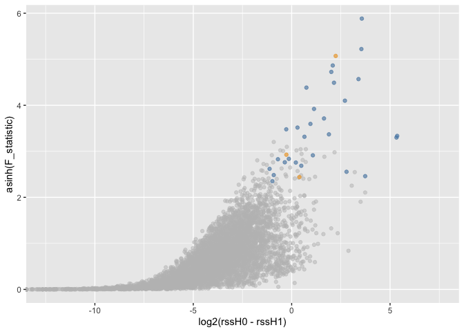
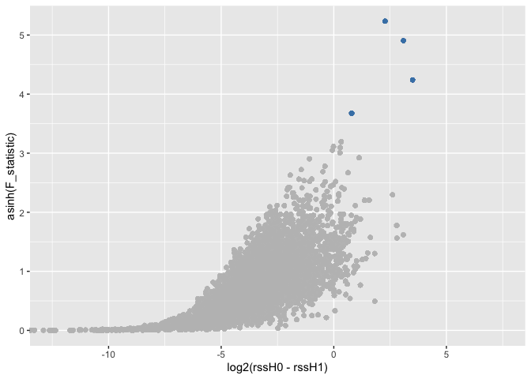

Make ‘Source data file’
================
07 July, 2020

``` r
library(tidyverse)
```

    ## ── Attaching packages ───────────────────────────────────────────────────────────────── tidyverse 1.3.0 ──

    ## ✓ ggplot2 3.3.2     ✓ purrr   0.3.4
    ## ✓ tibble  3.0.1     ✓ dplyr   1.0.0
    ## ✓ tidyr   1.1.0     ✓ stringr 1.4.0
    ## ✓ readr   1.3.1     ✓ forcats 0.5.0

    ## ── Conflicts ──────────────────────────────────────────────────────────────────── tidyverse_conflicts() ──
    ## x dplyr::filter() masks stats::filter()
    ## x dplyr::lag()    masks stats::lag()

``` r
library(TPP2D)
library(readxl)
library(openxlsx)
```

# Main figures

## Figure 1:

  - schematic illustrations only

## Figure 2

### Panobinostat

``` r
pano_cell_raw <- read_xlsx(
    file.path("..", "Panobinostat_HepG2_cell_2DTPP_Becher_et_al_2016",
              "41589_2016_BFnchembio2185_MOESM254_ESM.xlsx"), 
                           sheet = 1, skip = 1) %>% 
  dplyr::select(representative,
                clustername,
                experiment = ms_experiment,
                qupm,
                qusm,
                temperature,
                matches("sumionarea"),
                -matches("total"),
                matches("rel_fc_protein"),
                -matches("transformed"),
                -matches("orig"),
                -matches("log2rel"))  %>% 
  gather(key, value, matches("sumionarea"), matches("rel_fc_protein")) %>% 
  mutate(conc = as.numeric(gsub("uM", "", gsub(".+_protein_[0-9,H,L]+_[0-9,H,L]+_", "", key))),
         temperature = as.numeric(gsub("C", "", temperature)),
         key = case_when(grepl("sumionarea", key) ~ "raw_value",
                         grepl("rel_fc", key) ~ "rel_value")) %>% 
  spread(key, value) %>% 
  arrange(representative, temperature, conc) %>% 
  group_by(clustername, temperature, conc) %>% 
  filter(qupm == max(qupm), 
         qusm == max(qusm), 
         raw_value == max(raw_value)) %>% 
  filter(!duplicated(clustername)) %>% 
  ungroup %>% 
  mutate(log2_value = log2(raw_value),
         log_conc = log10(conc/1e6)) %>% 
  filter(qupm > 1)

# resolve ambiguous protein names
pano_cell_fil <- resolveAmbiguousProteinNames(pano_cell_raw)
  
# recompute reporter ion signal from robust Isobarquant fold changes
pano_cell_df <- recomputeSignalFromRatios(pano_cell_fil)
```

Compute null and alternative model fits and extract parameters

``` r
pano_params_df <- getModelParamsDf(pano_cell_df, maxit = 500)
saveRDS(pano_params_df, file = "../pre_run_data/pano_params_df.rds")
```

Compute *F* statistics

``` r
pano_fstat_df <- computeFStatFromParams(pano_params_df)
```

Get \(B\) datasets expected under the null model and perform model
fitting and compute F statistics to obtain a null distribution for FDR
calibration:

``` r
set.seed(12, kind = "L'Ecuyer-CMRG")
pano_null_df <- bootstrapNullAlternativeModel(
  df = pano_cell_df, params_df = pano_params_df, 
  maxit = 500, B = 100,
  BPPARAM = BiocParallel::MulticoreParam(workers = 20, progressbar = TRUE),
  verbose = FALSE)
saveRDS(pano_null_df, file = "../pre_run_data/pano_null_df.rds")
```

Compute FDR and find hits:

``` r
pano_fdr_df <- getFDR(df_out = pano_fstat_df,
                     df_null = pano_null_df,
                     squeezeDenominator = TRUE)
  
pano_hits_df <- findHits(pano_fdr_df, alpha = 0.1)
```

Make output table

``` r
pano_out_tab <- pano_fdr_df %>% filter(dataset == "true") %>% 
    dplyr::select(representative, clustername, rssH0,  rssH1, F_statistic) %>% 
    mutate(stabilized_hit_at_10percent_FDR = 
               case_when(
                   representative %in% 
                       filter(pano_hits_df, slopeH1 > 0)$representative ~ 
                       TRUE, TRUE ~ FALSE),
           destabilized_hit_at_10percent_FDR = 
               case_when(representative %in% 
                             filter(pano_hits_df, slopeH1 < 0)$representative ~
                             TRUE, TRUE ~ FALSE)) 
```

Make sure we can still make the plot

``` r
ggplot(pano_out_tab, aes(log2(rssH0-rssH1), asinh(F_statistic))) +
    geom_point(color = "gray", alpha = 0.5) +
    geom_point(color = "steelblue", alpha = 0.5, 
               data = filter(pano_out_tab, stabilized_hit_at_10percent_FDR)) +
    geom_point(color = "orange", alpha = 0.5, 
               data = filter(pano_out_tab, destabilized_hit_at_10percent_FDR)) +
    coord_cartesian(xlim = c(-12.5, 7.5))
```


\#\#\# JQ1

``` r
jq1_lys_raw <- read_xlsx(file.path(
  "../JQ1_THP1_lysate_2DTPP_Savitski_et_al_2018/", 
  "Savitski_et_al_Figure_3/Supplementary Dataset 2_2D-TPP.xlsx"), 
  sheet = 3, skip = 1) %>% 
  dplyr::select(representative = `Accession No.`,
                clustername = `protein name`,
                qupm = QUPM,
                qusm = QUSM,
                temperature,
                matches("sumionarea"),
                -matches("total"),
                matches("rel_fc_protein"),
                -matches("transformed"),
                -matches("orig"))  %>% 
  gather(key, value, matches("sumionarea"), matches("rel_fc_protein")) %>% 
  mutate(conc = as.numeric(gsub("uM", "", gsub(".+_protein_[0-9,H,L]+_[0-9,H,L]+_", "", key))),
         temperature = as.numeric(gsub("C", "", temperature)),
         key = case_when(grepl("sumionarea", key) ~ "raw_value",
                         grepl("rel_fc", key) ~ "rel_value")) %>% 
  spread(key, value) %>% 
  arrange(representative, temperature, conc) %>% 
  group_by(clustername, temperature, conc) %>% 
  filter(qupm == max(qupm), 
         qusm == max(qusm), 
         raw_value == max(raw_value)) %>% 
  filter(!duplicated(clustername)) %>% 
  ungroup %>% 
  mutate(log2_value = log2(raw_value),
         log_conc = log10(conc/1e6)) %>% 
  filter(qupm > 1)

# resolve ambiguous protein names
jq1_lys_fil <- resolveAmbiguousProteinNames(jq1_lys_raw)
  
# recompute reporter ion signal from robust Isobarquant fold changes
jq1_lys_df <- recomputeSignalFromRatios(jq1_lys_fil)
```

Compute null and alternative model fits and extract parameters

``` r
jq1_params_df <- getModelParamsDf(jq1_lys_df, maxit = 500)
saveRDS(jq1_params_df, file = "../pre_run_data/jq1_params_df.rds")
```

Compute *F* statistics

``` r
jq1_fstat_df <- computeFStatFromParams(jq1_params_df)
```

Get \(B\) datasets expected under the null model and perform model
fitting and compute F statistics to obtain a null distribution for FDR
calibration:

``` r
set.seed(12, kind = "L'Ecuyer-CMRG")
jq1_null_df <- bootstrapNullAlternativeModel(
  df = jq1_lys_df, params_df = jq1_params_df, 
  maxit = 500, B = 100,
  BPPARAM = BiocParallel::MulticoreParam(workers = 20, progressbar = TRUE),
  verbose = FALSE)
saveRDS(jq1_null_df, file = "../pre_run_data/jq1_null_df.rds")
```

Compute FDR and find hits:

``` r
jq1_fdr_df <- getFDR(df_out = jq1_fstat_df,
                     df_null = jq1_null_df,
                     squeezeDenominator = TRUE)
  
jq1_hits_df <- findHits(jq1_fdr_df, alpha = 0.1)
```

Make output table

``` r
jq1_out_tab <- left_join(
    jq1_lys_raw,  
    jq1_fdr_df %>% 
        filter(dataset == "true") %>% 
        dplyr::select(representative, clustername, rssH0,  rssH1, F_statistic),
    by = c("representative", "clustername")) %>% 
    mutate(stabilized_hit_at_10percent_FDR = 
               case_when(representative %in% 
                             filter(jq1_hits_df, slopeH1 > 0)$representative ~
                             TRUE, TRUE ~ FALSE),
           destabilized_hit_at_10percent_FDR = 
               case_when(representative %in% 
                             filter(jq1_hits_df, slopeH1 < 0)$representative ~
                             TRUE, TRUE ~ FALSE))
```

Make sure we can still make the plot

``` r
ggplot(jq1_out_tab, aes(log2(rssH0-rssH1), asinh(F_statistic))) +
    geom_point(color = "gray", alpha = 0.5) +
    geom_point(color = "steelblue", alpha = 0.5, 
               data = filter(jq1_out_tab, stabilized_hit_at_10percent_FDR)) +
    geom_point(color = "orange", alpha = 0.5, 
               data = filter(jq1_out_tab, destabilized_hit_at_10percent_FDR)) +
    coord_cartesian(xlim = c(-12.5, 7.5))
```

    ## Warning: Removed 9297 rows containing missing values (geom_point).



# Supplementary figures
